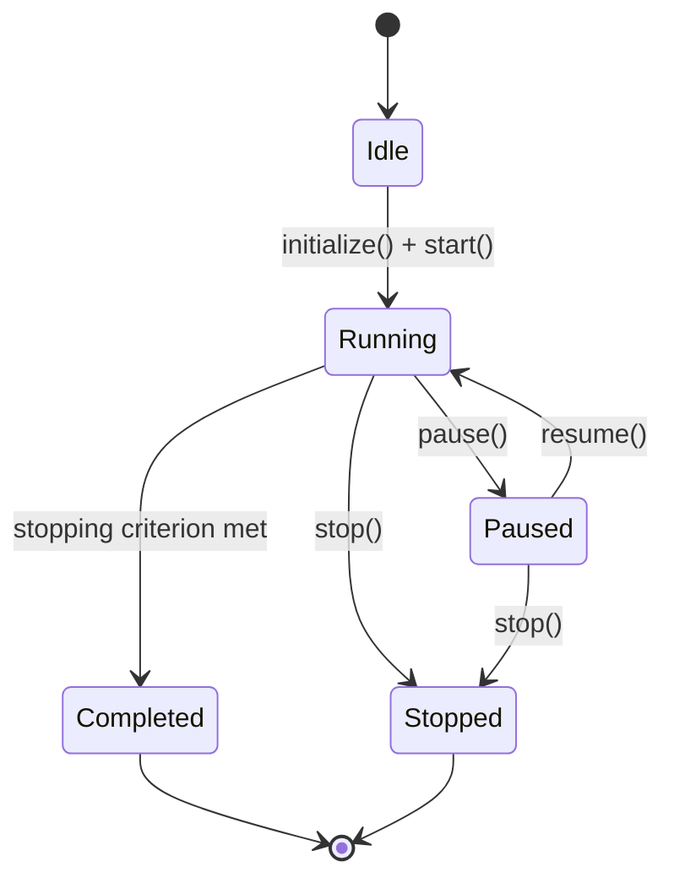
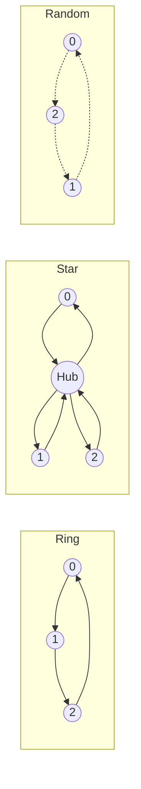

# AEGIS — Adaptive Evolutionary Guided Identification System

> **Nonlinear dynamic system identification via Differential Evolution with island model, JADE adaptive mutation, and intelligent agent interface.**

AEGIS is a web application built with Flutter/Dart that automatically identifies polynomial and rational NARX (*Nonlinear AutoRegressive with eXogenous inputs*) models from experimental data. The evolutionary engine uses an archipelago of populations with topological migration, JADE adaptive strategies, and ERR-based evaluation with pseudo-linearization, all orchestrated by an agent dashboard with 34 real-time indicators and 12 tunable parameters during execution.

---

## Table of Contents

1. [Overview](#1-overview)
2. [System Architecture](#2-system-architecture)
3. [NARX Model](#3-narx-model)
4. [Chromosome Encoding](#4-chromosome-encoding)
5. [Data Preprocessing](#5-data-preprocessing)
6. [Differential Evolution Engine](#6-differential-evolution-engine)
7. [Mutation Strategies](#7-mutation-strategies)
8. [Crossover Operators](#8-crossover-operators)
9. [Fitness Evaluation](#9-fitness-evaluation)
10. [Island Model and Migration](#10-island-model-and-migration)
11. [Stopping Criteria](#11-stopping-criteria)
12. [Model Validation](#12-model-validation)
13. [Agent System](#13-agent-system)
14. [User Interface](#14-user-interface)
15. [Complete Flowchart](#15-complete-flowchart)
16. [Project Structure](#16-project-structure)
17. [Build and Execution](#17-build-and-execution)
18. [References](#18-references)

---

## 1. Overview

AEGIS solves the **system identification** problem — given an input/output dataset $\{u(k), y(k)\}_{k=1}^{N}$, automatically find:

- The model **structure** (which terms, delays, and exponents).
- The **coefficients** $\theta_j$ for each regressor.
- The **confidence level** of the representation (quality metrics).

The process is fully automated: the user loads data, assigns input/output variables, and the evolutionary engine discovers the best NARX model without manual intervention.

---

## 2. System Architecture

| Layer | Components | Responsibility |
|-------|-----------|----------------|
| **Data Layer** | DataLoader · Normalizer · Splitter | File parsing, normalization, partitioning |
| **Engine Layer** | DEEngine · Islands · Migration | Differential Evolution optimization |
| **Agent Layer** | Snapshot · History · Tuning | Real-time monitoring and parameter control |
| **UI Layer** | Screens · Charts · State | User interaction and visualization |
| **Core Layer** | Matrix (Float64List) · QR · Types · PRNG | Mathematical foundations |

**Data flow:** Data Layer → Engine Layer → Agent Layer → UI Layer

**Design principles:**

| Principle | Application |
|-----------|-------------|
| **S** — Single Responsibility | Each class solves a single problem (e.g., `ErrCalculator` only computes ERR) |
| **O** — Open/Closed | Mutation/crossover strategies are extensible abstract interfaces |
| **L** — Liskov Substitution | `BicFitness` and `AicFitness` are interchangeable via `FitnessEvaluator` |
| **I** — Interface Segregation | `MutationStrategy` and `CrossoverStrategy` are minimal contracts |
| **D** — Dependency Inversion | `Island` depends on abstractions (`MutationStrategy`, `FitnessEvaluator`) |

---

## 3. NARX Model

### 3.1 Polynomial Model

The general polynomial NARX model is:

$$y(k) = \sum_{j=1}^{n_\theta} \theta_j \prod_{m=1}^{p_j} x_{i_m}(k - \tau_m)^{\alpha_m} + e(k)$$

where:
- $y(k)$ is the output at time step $k$
- $x_{i_m}$ is the variable with index $i_m$ (input $u$ or output $y$)
- $\tau_m \geq 1$ is the delay
- $\alpha_m \in \{0.5, 1.0, 1.5, \ldots, 5.0\}$ is the exponent (quantized in 0.5 steps)
- $\theta_j$ is the coefficient of the $j$-th regressor
- $n_\theta$ is the number of selected regressors
- $e(k)$ is the residual

**Concrete example:**

$$y(k) = \theta_1 \cdot y(k-1) + \theta_2 \cdot u(k-1)^2 + \theta_3 \cdot u(k-2) \cdot y(k-3) + e(k)$$

### 3.2 Rational Model (with Pseudo-linearization)

For rational representations, the model takes the form:

$$y(k) = \frac{\sum_{j \in \mathcal{N}} \theta_j \varphi_j(k)}{\displaystyle 1 + \sum_{j \in \mathcal{D}} \theta_j \varphi_j(k)}$$

where $\mathcal{N}$ is the set of numerator regressors and $\mathcal{D}$ the denominator set.

**Pseudo-linearization** transforms this nonlinear problem into a linear one:

$$y(k) = \sum_{j \in \mathcal{N}} \theta_j \varphi_j(k) - \sum_{j \in \mathcal{D}} \theta_j \cdot y(k) \cdot \varphi_j(k)$$

Defining the extended regressor vector:

$$\psi_j(k) = \begin{cases} \varphi_j(k) & \text{if } j \in \mathcal{N} \text{ (numerator)} \\ -y(k) \cdot \varphi_j(k) & \text{if } j \in \mathcal{D} \text{ (denominator)} \end{cases}$$

---

## 4. Chromosome Encoding

Each individual (chromosome) encodes a candidate model structure:

```
Chromosome
├── regressors: List<Regressor>        // Model structure
│   └── Regressor
│       └── components: List<CompoundTerm>
│           └── CompoundTerm
│               ├── term: Term
│               │   ├── variable: int      // Variable index (0..n-1)
│               │   ├── delay: int         // Time delay τ ≥ 1
│               │   └── isDenominator: bool // Numerator or denominator
│               └── exponent: double       // α ∈ [0.5, 5.0]
├── coefficients: List<double>?        // θ estimated via QR (null if unevaluated)
├── err: List<double>?                 // ERR per regressor
├── fitness: double                    // BIC/AIC (NaN if unevaluated)
├── sse: double                        // Sum of squared errors
├── outputIndex: int                   // Output index (for MIMO)
└── maxDelay: int                      // max(τ) across all terms
```

The chromosome is **immutable** — updates produce new instances via `withEvaluation()` and `withRegressors()`.

**Structural hash:** each `Regressor` has a combinatorial hash for efficient duplicate detection in the population:

$$h(R) = \bigoplus_{(t, \alpha) \in R} \text{hash}(t.\text{variable}, t.\text{delay}, \alpha)$$

---

## 5. Data Preprocessing

### 5.1 Loading

The `DataLoader` supports multiple formats with auto-detection:

| Format | Separators | Detection |
|--------|------------|-----------|
| CSV | `,` | Occurrence counting |
| TSV | `\t` | Occurrence counting |
| Space | ` ` | Fallback |
| Semicolon | `;` | Occurrence counting |

Options: header row (toggle), column selection, preview of the first 10 records.

### 5.2 Min-Max Normalization

Each column $j$ is independently normalized:

$$x_{norm}^{(j)} = L + \frac{R \cdot (x^{(j)} - x_{min}^{(j)})}{x_{max}^{(j)} - x_{min}^{(j)}}$$

with $L = 0.01$, $R = 0.99$, resulting in $x_{norm} \in [0.01, 1.0]$.

The range avoids zero (which would nullify multiplicative terms) and preserves the relative scale between samples.

### 5.3 Sequential Partitioning

Data is split **sequentially** (preserving temporal order):

| Partition | Proportion | Use |
|-----------|------------|-----|
| Training | 70% | Parameter estimation $\theta$ |
| Validation | 15% | Model selection (early stopping) |
| Test | 15% | Final evaluation (unseen by engine) |

---

## 6. Differential Evolution Engine

### 6.1 State Machine



### 6.2 Batch Execution

To avoid blocking the UI thread, the engine runs in batches of `generationsPerBatch` generations (default: 10) with a `Timer.periodic` of 16 ms (~60 fps):

```
Timer(16ms) → runBatch(10 gens) → yield → Timer(16ms) → runBatch(10 gens) → ...
```

Each call to `runBatch()`:

1. Executes 1 generation on **each island**
2. Checks if migration is due
3. Builds `GenerationSnapshot` with 34 indicators
4. Checks composite stopping criteria
5. Returns `true` (continue) or `false` (stop)

### 6.3 Single Generation Cycle (per island)

For each individual $i \in \{0, \ldots, NP-1\}$:

1. **Generate adaptive parameters** $F_i$, $CR_i$ via JADE
2. **Mutation** → mutant vector $\mathbf{v}_i$
3. **Crossover** → trial vector $\mathbf{u}_i$
4. **Build regressor matrix** $\Psi$ for the trial
5. **Evaluate** → coefficients $\theta$ via QR, fitness via BIC
6. **Greedy selection**: if $f(\mathbf{u}_i) < f(\mathbf{x}_i)$, replace
7. If accepted, record $F_i$, $CR_i$ as successful

At the end of the generation:
- Update $\mu_F$, $\mu_{CR}$ via JADE
- Update stagnation counter

---

## 7. Mutation Strategies

### 7.1 DE/rand/1

$$\mathbf{v}_i = \mathbf{x}_{r_0} + F \cdot (\mathbf{x}_{r_1} - \mathbf{x}_{r_2})$$

where $r_0, r_1, r_2$ are distinct randomly chosen indices, $r_j \neq i$.

**Operation at the regressor level:** mutation operates on the exponents of `CompoundTerm`:

$$\alpha_j^{(v)} = \text{clamp}\!\left(\alpha_j^{(r_0)} + F \cdot (\alpha_j^{(r_1)} - \alpha_j^{(r_2)}),\; 0.5,\; 5.0\right)$$

with quantization:

$$\alpha \leftarrow \frac{\lfloor 2\alpha \rfloor}{2} \quad \text{(0.5 steps)}$$

### 7.2 JADE — DE/current-to-pbest/1

$$\mathbf{v}_i = \mathbf{x}_i + F_i \cdot (\mathbf{x}_{p\text{-best}} - \mathbf{x}_i) + F_i \cdot (\mathbf{x}_{r_1} - \mathbf{x}_{r_2})$$

where $\mathbf{x}_{p\text{-best}}$ is randomly selected from the top-$p$ individuals:

$$p = \max\!\left(2,\; \lfloor 0.05 \cdot NP \rfloor\right)$$

**Adaptive parameters per individual:**

- $F_i \sim \text{Cauchy}(\mu_F, 0.1)$, truncated to $[0, 1]$

$$f_{\text{Cauchy}}(x; \mu, \gamma) = \frac{1}{\pi\gamma\left[1 + \left(\frac{x-\mu}{\gamma}\right)^2\right]}$$

- $CR_i \sim \mathcal{N}(\mu_{CR}, 0.1)$, truncated to $[0, 1]$

**End-of-generation update:**

Given the set of successful parameters $S_F = \{F_i : \text{trial}_i \text{ accepted}\}$:

$$\mu_F \leftarrow (1 - c)\,\mu_F + c \cdot \text{mean}_L(S_F)$$

where $\text{mean}_L$ is the **Lehmer mean**:

$$\text{mean}_L(S_F) = \frac{\sum_{F \in S_F} F^2}{\sum_{F \in S_F} F}$$

For $CR$:

$$\mu_{CR} \leftarrow (1 - c)\,\mu_{CR} + c \cdot \overline{S_{CR}}$$

with $c = 0.1$ (adaptation rate). Initial values: $\mu_F = 0.5$, $\mu_{CR} = 0.5$.

---

## 8. Crossover Operators

### 8.1 Binomial Crossover (Uniform)

For each gene $j \in \{1, \ldots, D\}$:

$$u_{i,j} = \begin{cases} v_{i,j} & \text{if } \text{rand}_j < CR \text{ or } j = j_{\text{rand}} \\ x_{i,j} & \text{otherwise} \end{cases}$$

where $j_{\text{rand}} \sim \text{Uniform}\{1,\ldots,D\}$ ensures at least one gene comes from the mutant.

### 8.2 Exponential Crossover (Segmented)

Selects a starting point $L$ and copies a contiguous segment from the mutant:

$$u_{i,j} = \begin{cases} v_{i,j} & \text{if } j \in [L, L+n) \bmod D \\ x_{i,j} & \text{otherwise} \end{cases}$$

where $n$ is the segment length, controlled by $CR$: at each position, it continues with probability $CR$.

---

## 9. Fitness Evaluation

### 9.1 Regressor Matrix Construction

For a chromosome with $k$ regressors and data with $N$ samples and maximum delay $\tau_{\max}$:

$$\Psi \in \mathbb{R}^{(N - \tau_{\max}) \times k}$$

$$\psi_{t,j} = \prod_{(x_i, \tau_m, \alpha_m) \in R_j} x_i(t - \tau_m)^{\alpha_m}$$

For denominator regressors (rational model), pseudo-linearization is applied:

$$\psi_{t,j} \leftarrow -y(t) \cdot \psi_{t,j} \quad \text{if } R_j \in \mathcal{D}$$

### 9.2 Coefficient Estimation via QR

The coefficients $\theta$ are estimated by least squares:

$$\Psi\,\theta = \mathbf{y} \implies \theta = (\Psi^T\Psi)^{-1}\Psi^T\mathbf{y}$$

Solved numerically via QR decomposition (Modified Gram-Schmidt):

1. $\Psi = Q R$ where $Q^TQ = I$, $R$ upper triangular
2. $R\,\theta = Q^T\mathbf{y}$
3. $\theta$ obtained by **back-substitution**:

$$\theta_i = \frac{(Q^T\mathbf{y})_i - \sum_{j=i+1}^{k} R_{ij}\,\theta_j}{R_{ii}}$$

### 9.3 ERR — Error Reduction Ratio

Each regressor is evaluated by the fraction of output variance it explains:

$$\text{ERR}_j = \frac{(\mathbf{q}_j^T \mathbf{y})^2}{(\mathbf{q}_j^T \mathbf{q}_j)(\mathbf{y}^T \mathbf{y})}$$

where $\mathbf{q}_j$ is the $j$-th orthogonalized column (from QR of $\Psi$).

The total sum:

$$\sum_{j=1}^{k} \text{ERR}_j \leq 1$$

indicates the explained fraction. Values close to 1 indicate a complete model.

### 9.4 Information Criteria

**BIC** (Bayesian Information Criterion):

$$\text{BIC} = n \cdot \ln\!\left(\frac{SSE}{n}\right) + k \cdot \ln(n)$$

**AIC** (Akaike Information Criterion):

$$\text{AIC} = n \cdot \ln\!\left(\frac{SSE}{n}\right) + 2k$$

where:
- $n$ = effective number of samples $(N - \tau_{\max})$
- $k$ = number of regressors (parameters)
- $SSE = \sum_{t=1}^{n} (y(t) - \hat{y}(t))^2$

BIC penalizes complexity more strongly for $n > e^2 \approx 7.4$, favoring parsimonious models.

---

## 10. Island Model and Migration

### 10.1 Archipelago

The engine maintains $N_I$ independent islands, each with:

- Own RNG: `seed = timestamp + id × 7919`
- Mutation strategy (JADE by default)
- Population of $NP$ chromosomes
- Independent adaptive parameters $\mu_F$, $\mu_{CR}$
- Isolated stagnation counter

Diversity between islands is maintained by independent initialization and periodic migration.

### 10.2 Migration Topologies



| Topology | Mechanism | Characteristic |
|----------|-----------|----------------|
| **Ring** | Island $i$ sends to island $(i+1) \bmod N_I$ | Gradual propagation, balanced |
| **Star** | Best island distributes to all | Fast convergence, centralized |
| **Random** | Random pairs | Maximum exploration |

### 10.3 Migration Protocol

- **Period:** every `migrationInterval` generations (default: 20)
- **Number of migrants:** $\lfloor 0.1 \times NP \rfloor$, limited to $[1, 5]$
- **Selection:** best individuals from source island
- **Replacement:** worst individuals in destination island
- **Impact:** recorded in `migrationImpact` in the snapshot

---

## 11. Stopping Criteria

Five independent criteria combined via `CompositeCriterion` (any one triggers a stop):

| Criterion | Condition | Default | Description |
|-----------|-----------|---------|-------------|
| **MaxGenerations** | $g \geq g_{\max}$ | 5000 | Absolute generation limit |
| **StagnationLimit** | $s \geq s_{\max}$ | 500 | Generations without improvement in best fitness |
| **PopulationVariance** | $\sigma^2(f) < \epsilon \;\wedge\; g > 10$ | $\epsilon = 10^{-10}$ | Premature convergence |
| **RelativeImprovement** | $\left\lvert\frac{f_g - f_{g-w}}{f_{g-w}}\right\rvert < \delta$ | $\delta = 10^{-8}$, $w = 50$ | Marginal improvement |
| **TimeLimit** | $t_{\text{elapsed}} \geq t_{\max}$ | configurable | Execution time |

Composition:

$$\text{shouldStop} = \bigvee_{c \in \mathcal{C}} c.\text{shouldStop}(\text{context})$$

---

## 12. Model Validation

### 12.1 RMSE (Root Mean Square Error)

$$\text{RMSE} = \sqrt{\frac{1}{n}\sum_{t=1}^{n}(y(t) - \hat{y}(t))^2}$$

### 12.2 Coefficient of Determination $R^2$

$$R^2 = 1 - \frac{SS_{\text{res}}}{SS_{\text{tot}}} = 1 - \frac{\sum(y_t - \hat{y}_t)^2}{\sum(y_t - \bar{y})^2}$$

- $R^2 = 1$: perfect fit
- $R^2 = 0$: model equivalent to the mean
- $R^2 < 0$: model worse than the mean

### 12.3 Residual Analysis

The residuals $e(t) = y(t) - \hat{y}(t)$ should be white noise. The normalized autocorrelation:

$$\rho_\ell = \frac{\sum_{t=1}^{n-\ell}(e_t - \bar{e})(e_{t+\ell} - \bar{e})}{\sum_{t=1}^{n}(e_t - \bar{e})^2}, \quad \ell = 0, 1, \ldots, L_{\max}$$

with $\rho_0 = 1$ by construction. The 95% confidence interval is:

$$\pm \frac{1.96}{\sqrt{n}}$$

Values of $\rho_\ell$ within the bands indicate uncorrelated residuals (adequate model).

---

## 13. Agent System

### 13.1 GenerationSnapshot — 34 Indicators

Each generation produces a snapshot with the following fields:

| Group | Indicator | Type | Description |
|-------|-----------|------|-------------|
| **Identification** | `generation` | `int` | Current generation number |
| | `elapsed` | `Duration` | Time since start |
| **Global Fitness** | `bestFitness` | `double` | Best fitness (min BIC) |
| | `worstFitness` | `double` | Worst fitness |
| | `meanFitness` | `double` | Mean fitness |
| | `medianFitness` | `double` | Median fitness |
| | `stdDevFitness` | `double` | Standard deviation $\sigma$ |
| | `q1Fitness` | `double` | First quartile (P25) |
| | `q3Fitness` | `double` | Third quartile (P75) |
| **Improvement** | `improvementAbsolute` | `double` | $\Delta f = f_{g-1} - f_g$ |
| | `improvementRelative` | `double` | $\Delta f / \lvert f_{g-1}\rvert$ |
| | `improvementRate5` | `double` | Improvement rate (window 5) |
| | `improvementRate20` | `double` | Improvement rate (window 20) |
| **Convergence** | `stagnationCounter` | `int` | Generations without improvement |
| | `populationVariance` | `double` | Fitness $\sigma^2$ |
| | `successRate` | `double` | Fraction of accepted trials |
| | `successRateHistory` | `List<double>` | Rate history |
| | `uniqueStructures` | `int` | Distinct chromosome structures |
| **Diversity** | `structureEntropy` | `double` | Shannon entropy (hashes) |
| | `phenotypicDiversity` | `double` | $\sigma$ in fitness space |
| **Best Model** | `bestModelComplexity` | `int` | Number of regressors |
| | `bestModelMaxDegree` | `double` | Highest exponent |
| | `bestModelMaxDelay` | `int` | Highest delay $\tau$ |
| | `bestModelERR` | `List<double>` | ERR vector per regressor |
| | `bestModelRMSE` | `double` | Training RMSE |
| | `bestModelValidationRMSE` | `double?` | Validation RMSE |
| | `bestModelR2` | `double` | Training $R^2$ |
| | `residualAutocorrelation` | `List<double>?` | $\rho_\ell$ up to lag 20 |
| **Topology** | `islandSnapshots` | `List<IslandSnapshot>` | Per-island data |
| | `migrationImpact` | `double?` | Post-migration improvement |
| **Frequency** | `regressorFrequency` | `Map<int, double>` | Term histogram |

### 13.2 IslandSnapshot (per island)

| Field | Description |
|-------|-------------|
| `islandId` | Island identifier |
| `generation` | Local generation |
| `stats` | `PopulationStats` (best/worst/mean/median/stdDev/q1/q3/uniqueStructures/entropy) |
| `bestChromosome` | Local best individual |
| `stagnationCounter` | Local stagnation |
| `successRate` | Local acceptance rate |
| `muF` | JADE parameter $\mu_F$ current value |
| `muCR` | JADE parameter $\mu_{CR}$ current value |

### 13.3 Real-Time Tunable Parameters

| # | Parameter | Min | Default | Max | Type | Scope |
|---|-----------|-----|---------|-----|------|-------|
| 1 | `mutationFactor` ($F$) | 0.0 | **0.5** | 2.0 | continuous | global |
| 2 | `crossoverRate` ($CR$) | 0.0 | **0.9** | 1.0 | continuous | global |
| 3 | `populationSize` ($NP$) | 20 | **50** | 500 | integer | per-island |
| 4 | `elitismCount` | 0 | **2** | 20 | integer | global |
| 5 | `migrationInterval` | 5 | **20** | 100 | integer | global |
| 6 | `migrationRate` | 0.0 | **0.1** | 0.3 | continuous | global |
| 7 | `maxRegressors` | 2 | **8** | 20 | integer | global |
| 8 | `maxExponent` ($\alpha_{\max}$) | 1 | **3** | 5 | continuous | global |
| 9 | `maxDelay` ($\tau_{\max}$) | 1 | **20** | 50 | integer | global |
| 10 | `complexityPenalty` | 0.0 | **1.0** | 10.0 | continuous | global |
| 11 | `stagnationLimit` | 50 | **500** | 5000 | integer | global |
| 12 | `reinitializationRatio` | 0.0 | **0.1** | 0.5 | continuous | global |

Each slider allows parameter adjustment during execution. Actions are recorded in history (`TuningAction`) and applied in the next generation.

---

## 14. User Interface

### 14.1 Responsive Layout

| Viewport | Navigation | Breakpoint |
|----------|-----------|-----------|
| Large Desktop | Expanded `NavigationRail` (with labels) | ≥ 1200 px |
| Desktop / Tablet | Collapsed `NavigationRail` (icons only) | ≥ 768 px |
| Mobile | `BottomNavigationBar` | < 768 px |

### 14.2 Screens

| Screen | Function | Main Components |
|--------|----------|-----------------|
| **Data** | Load and assign variables | File picker, header toggle, separator selector, preview table, input/output assignment by click |
| **Evolution** | Real-time evolution monitoring | Controls (Start/Pause/Resume/Stop), KPIs (Generation, Fitness, $R^2$, Time), fitness chart (fl_chart), detailed metrics |
| **Agent** | Agent control panel | Grid of 12 indicators with semantic color, tuning sliders with reset, island monitor (bars), ERR contribution chart |
| **Results** | Final identified model | Mathematical equation (selectable monospace), quality metrics, ERR/coefficient table, autocorrelation with confidence bands, execution summary |

### 14.3 Color Palette

Dark theme with cool gray tones and cyan accent:

| Token | Hex | Usage |
|-------|-----|-------|
| `gray950` | `#0A0A0F` | Main background |
| `gray900` | `#131318` | Card surface |
| `gray850` | `#1C1C24` | Elevated surface |
| `gray800` | `#25252F` | Borders and separators |
| `gray750` | `#2F2F3A` | Slider tracks |
| `gray700` | `#3A3A47` | Hover |
| `gray600` | `#4E4E5C` | Disabled text |
| `gray500` | `#636373` | Tertiary text |
| `gray400` | `#8585A0` | Labels |
| `gray300` | `#A0A0B8` | Secondary text |
| `gray200` | `#C0C0D0` | Primary text |
| `gray100` | `#D8D8E4` | Icons |
| `gray50` | `#F4F4F8` | Highlight text |
| `accent` | `#5EC4D4` | Accent color (cyan) |
| `accentSubtle` | `#5EC4D4` α30% | Accent background |
| `success` | `#4ADE80` | Positive indicators |
| `warning` | `#FBBF24` | Alerts |
| `error` | `#F87171` | Errors |
| `info` | `#60A5FA` | Informational |

---

## 15. Complete Flowchart

```mermaid
flowchart TB
    A[/"📂 Load CSV / TSV file"/] --> B["Automatic parsing<br/>(auto-detect separator)"]
    B --> C["Assign variables<br/>Inputs (u) / Output (y)"]
    C --> D["Min-Max Normalization<br/>x ∈ [0.01, 1.0]"]
    D --> E["Partitioning<br/>70% train · 15% val · 15% test"]
    E --> F["Initialize DE Engine"]
    
    F --> G["Create N islands<br/>Independent RNG per island"]
    G --> H["Generate random populations<br/>ChromosomeFactory"]
    
    H --> I{{"Generation Loop<br/>g = 1, 2, ..., g_max"}}
    
    I --> J["For each Island i"]
    
    J --> K["For each individual j"]
    K --> L["JADE: generate F_j ~ Cauchy(μF, 0.1)<br/>CR_j ~ N(μCR, 0.1)"]
    L --> M["Mutation:<br/>DE/current-to-pbest/1"]
    M --> N["Crossover:<br/>Binomial or Exponential"]
    N --> O["Build Ψ<br/>(RegressorBuilder)"]
    O --> P["QR (Gram-Schmidt) → θ<br/>SSE, ERR, BIC"]
    P --> Q{"fitness(trial)<br/>< fitness(target)?"}
    
    Q -->|Yes| R["Accept trial<br/>Record (F_j, CR_j) in S"]
    Q -->|No| S["Keep target"]
    
    R --> T["Next individual"]
    S --> T
    T --> K
    
    T -->|All processed| U["JADE Adaptation<br/>μF ← Lehmer(S_F)<br/>μCR ← Mean(S_CR)"]
    U --> V["Update stagnation"]
    V --> J
    
    V -->|All islands| W{"g mod 20 = 0?"}
    W -->|Yes| X["Migration<br/>(Ring / Star / Random)"]
    W -->|No| Y["Build Snapshot<br/>(34 indicators)"]
    X --> Y
    
    Y --> Z["Emit to UI<br/>+ Agent Dashboard"]
    
    Z --> AA{"Stopping<br/>criterion?"}
    AA -->|No| I
    AA -->|Yes| AB["Select best model<br/>global across all islands"]
    
    AB --> AC["Final validation<br/>RMSE, R², Autocorrelation"]
    AC --> AD[/"📊 Display Results<br/>Equation · Metrics · Charts"/]
    
    style A fill:#1a1a2e,stroke:#5EC4D4,color:#F4F4F8
    style AD fill:#1a1a2e,stroke:#4ADE80,color:#F4F4F8
    style Q fill:#2a2a3e,stroke:#FBBF24,color:#F4F4F8
    style AA fill:#2a2a3e,stroke:#FBBF24,color:#F4F4F8
    style W fill:#2a2a3e,stroke:#60A5FA,color:#F4F4F8
    style I fill:#1a1a2e,stroke:#F87171,color:#F4F4F8
```



---

## 16. Project Structure

```
lib/
├── main.dart                              # Entry point (AegisApp)
│
├── core/                                  # Mathematical foundations and types
│   ├── math/
│   │   ├── matrix.dart                    # Column-major matrix (Float64List)
│   │   ├── matrix_view.dart               # Immutable view over Matrix
│   │   ├── decomposition.dart             # QR (Gram-Schmidt + Householder)
│   │   └── math.dart                      # Barrel export
│   ├── types/
│   │   ├── term.dart                      # Term (variable, delay, isDenom)
│   │   ├── regressor.dart                 # CompoundTerm + Regressor
│   │   ├── chromosome.dart                # Immutable chromosome
│   │   ├── narx_model.dart                # Final identified model
│   │   └── types.dart                     # Barrel export
│   └── random/
│       └── xorshift128.dart               # PRNG (dart:math wrapper for web)
│
├── engine/                                # Optimization engine
│   ├── fitness/
│   │   ├── fitness_evaluator.dart         # Abstract interface
│   │   ├── bic_fitness.dart               # BIC + AIC (with integrated QR)
│   │   └── err_calculator.dart            # ERR with pseudo-linearization
│   ├── de/
│   │   ├── strategies/
│   │   │   ├── mutation_strategy.dart     # Interface + MutationParams
│   │   │   ├── de_rand_1.dart             # DE/rand/1
│   │   │   ├── jade_mutation.dart         # Adaptive JADE
│   │   │   ├── crossover_strategy.dart    # Binomial + Exponential
│   │   │   └── strategies.dart            # Barrel export
│   │   ├── chromosome_factory.dart        # Random chromosome generation
│   │   ├── population.dart                # Population management
│   │   ├── island.dart                    # Complete DE island
│   │   ├── regressor_builder.dart         # Build Ψ from data
│   │   ├── migration.dart                 # Ring/Star/Random migration
│   │   └── de_engine.dart                 # Main orchestrator
│   ├── identification/
│   │   ├── data_normalizer.dart           # Min-max normalization [0.01, 1.0]
│   │   ├── data_splitter.dart             # Sequential split 70/15/15
│   │   └── model_validator.dart           # RMSE, R², residuals
│   └── stopping/
│       └── stopping_criterion.dart        # 5 criteria + composition
│
├── agent/                                 # Intelligent monitoring system
│   ├── generation_snapshot.dart           # Snapshot with 34 indicators
│   ├── tunable_parameter.dart             # 12 parameters + ParameterRegistry
│   └── generation_history.dart            # History + TuningAction
│
├── data/
│   └── data_loader.dart                   # CSV/TSV/space parsing with auto-detect
│
└── ui/                                    # Flutter interface
    ├── theme/
    │   └── app_theme.dart                 # Cool gray palette + cyan accent
    ├── state/
    │   └── app_state.dart                 # Riverpod (EngineNotifier + providers)
    ├── screens/
    │   ├── home_screen.dart               # Responsive shell (Rail/BottomNav)
    │   ├── data_screen.dart               # Data loading and assignment
    │   ├── evolution_screen.dart          # Real-time monitoring
    │   ├── agent_dashboard_screen.dart    # Agent dashboard
    │   └── results_screen.dart            # Final model and diagnostics
    └── widgets/
        └── stat_card.dart                 # StatCard + MiniStat
```

---

## 17. Build and Execution

### Prerequisites

- Flutter SDK ≥ 3.27
- Dart SDK ≥ 3.11

### Commands

```bash
# Install dependencies
flutter pub get

# Static analysis (should return zero issues)
dart analyze lib

# Web build (release)
flutter build web --release

# Run in browser
flutter run -d chrome

# WASM build (experimental)
flutter build web --wasm
```

### Dependencies

| Package | Version | Usage |
|---------|---------|-------|
| `flutter_riverpod` | ^2.6.1 | Reactive state management |
| `fl_chart` | ^0.70.2 | Fitness and ERR charts |
| `file_picker` | ^8.1.6 | CSV/TSV file selection |
| `google_fonts` | ^6.2.1 | Typography (Inter) |
| `lucide_icons` | ^0.257.0 | Iconography |
| `collection` | ^1.19.1 | Collection utilities |

---

## 18. References

1. **Zhang, J. & Sanderson, A. C.** (2009). JADE: Adaptive Differential Evolution with Optional External Archive. *IEEE Trans. Evolutionary Computation*, 13(5), 945–958.

2. **Billings, S. A.** (2013). *Nonlinear System Identification: NARMAX Methods in the Time, Frequency, and Spatio-Temporal Domains*. Wiley.

3. **Chen, S., Billings, S. A. & Luo, W.** (1989). Orthogonal Least Squares Methods and their Application to Non-Linear System Identification. *Int. J. Control*, 50(5), 1873–1896.

4. **Storn, R. & Price, K.** (1997). Differential Evolution — A Simple and Efficient Heuristic for Global Optimization over Continuous Spaces. *J. Global Optimization*, 11(4), 341–359.

5. **Schwarz, G.** (1978). Estimating the Dimension of a Model. *Ann. Statist.*, 6(2), 461–464.

---

<div align="center">

**AEGIS v2.0** · Adaptive Evolutionary Guided Identification System

*Built with Flutter & Dart · Targeting Web (JS/WASM)*

</div>
