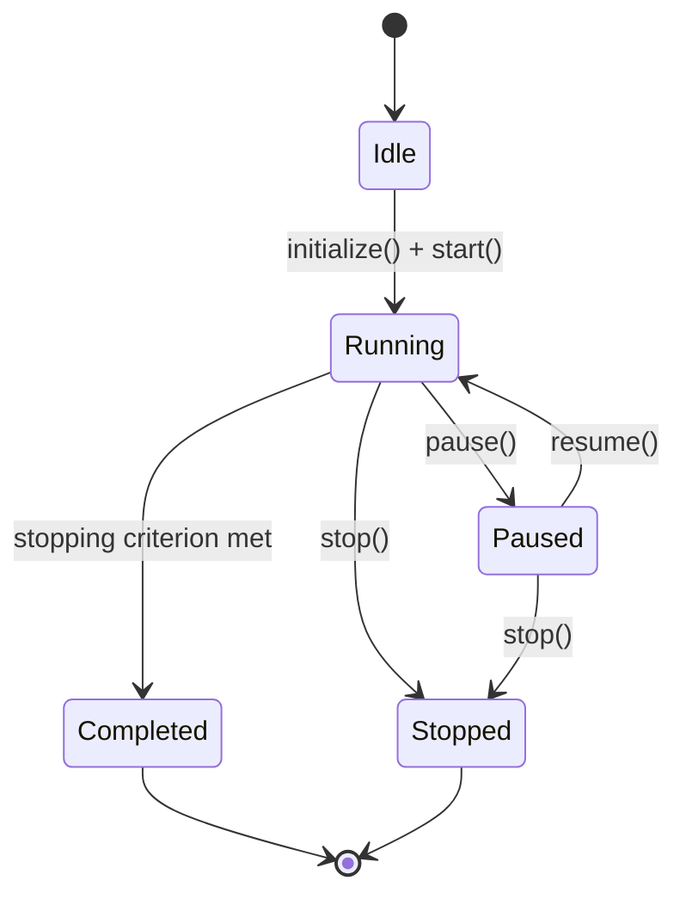
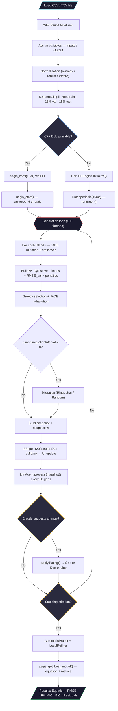

# AEGIS — Adaptive Evolutionary Guided Identification System

> **Nonlinear dynamic system identification via Differential Evolution with island model, JADE adaptive mutation, C++ computational core, and LLM agent interface.**

AEGIS automatically identifies polynomial and rational NARX (*Nonlinear AutoRegressive with eXogenous inputs*) models from experimental data. The computational core is a C++ shared library (`aegis_core`) compiled to a native DLL on Windows and to WebAssembly on the web, bridged to a Flutter/Dart UI through a conditional FFI layer. A Claude-powered LLM agent monitors the evolutionary engine in real time and suggests parameter adjustments via the Anthropic API.

---

## Table of Contents

1. [Overview](#1-overview)
2. [System Architecture](#2-system-architecture)
3. [NARX Model](#3-narx-model)
4. [Chromosome Encoding](#4-chromosome-encoding)
5. [Data Preprocessing](#5-data-preprocessing)
6. [Differential Evolution Engine](#6-differential-evolution-engine)
7. [Mutation Strategies](#7-mutation-strategies)
8. [Crossover Operators](#8-crossover-operators)
9. [Fitness Evaluation](#9-fitness-evaluation)
10. [Island Model and Migration](#10-island-model-and-migration)
11. [Stopping Criteria](#11-stopping-criteria)
12. [Model Validation and Diagnostics](#12-model-validation-and-diagnostics)
13. [Agent System](#13-agent-system)
14. [User Interface](#14-user-interface)
15. [Complete Flowchart](#15-complete-flowchart)
16. [Project Structure](#16-project-structure)
17. [Build and Execution](#17-build-and-execution)
18. [References](#18-references)

---

## 1. Overview

AEGIS solves the **system identification** problem — given an input/output dataset $\{u(k), y(k)\}_{k=1}^{N}$, automatically find:

- The model **structure** (which terms, delays, and exponents).
- The **coefficients** $\theta_j$ for each regressor.
- The **confidence level** of the representation (quality metrics).

The process is fully automated: the user loads data, assigns input/output variables, and the evolutionary engine discovers the best NARX model without manual intervention.

---

## 2. System Architecture

### 2.1 Hybrid C++ / Flutter Design

| Layer | Platform | Components | Responsibility |
|-------|----------|-----------|----------------|
| **C++ Core** | Windows (DLL) / Web (WASM) | `IdentificationPipeline` · `DEOptimizer` · `RationalModel` · `LocalRefiner` · `AgentController` | Full identification engine — DE, QR, diagnostics, WebSocket |
| **FFI Bridge** | Dart | `AegisFfiService` (native) · `AegisWasmService` (web) | Translates Dart calls ↔ C ABI (`aegis_api.h`) |
| **Dart Engine** | All platforms | `DEEngine` · `Island` · `Migration` | Pure-Dart fallback when C++ is unavailable |
| **LLM Agent** | Windows (native only) | `LlmAgent` | Calls Claude API every 50 generations to suggest DE tuning |
| **Agent Layer** | All platforms | `GenerationSnapshot` · `ParameterRegistry` · `GenerationHistory` | Real-time monitoring data structures |
| **Data Layer** | All platforms | `DataLoader` · `DataNormalizer` · `DataSplitter` | File parsing, normalization, partitioning |
| **UI Layer** | All platforms | Screens · Charts · Riverpod state | User interaction and visualization |

**Backend selection at runtime:**

| Platform | Computation engine | LLM Agent |
|----------|--------------------|-----------|
| Windows + `aegis_core.dll` | C++ via `dart:ffi` | Active (reads API key from env or file) |
| Windows without DLL | Dart `DEEngine` (fallback) | Active |
| Web (GitHub Pages) | Dart `DEEngine` | Inactive (`dart:io` not available) |

`AegisLibrary.tryLoad()` is called in `main()`. If the DLL load fails, `EngineNotifier` silently falls back to the Dart engine. On web, conditional exports ensure `dart:ffi`, `dart:io`, and `package:ffi` are never compiled.

**Data flow:**

```
Data Layer → C++ Core (or Dart Engine) → FFI Bridge → EngineNotifier
     ↓                                                       ↓
  Snapshot (JSON via FFI / callback)              LlmAgent (Claude API)
     ↓                                                       ↓
 UI Layer ← ←  ←  ←  Riverpod ←  ←  ←  applyTuning() ← ←  ┘
```

### 2.2 Design Principles

| Principle | Application |
|-----------|-------------|
| **S** — Single Responsibility | Each class solves a single problem (e.g., `CollinearityAnalyzer` only computes VIF) |
| **O** — Open/Closed | Mutation/crossover strategies are extensible abstract interfaces |
| **L** — Liskov Substitution | `AegisFfiService` and `DEEngine` are interchangeable via `EngineNotifier` |
| **I** — Interface Segregation | `MutationStrategy` and `CrossoverStrategy` are minimal contracts |
| **D** — Dependency Inversion | `EngineNotifier` depends on the abstract FFI/Dart service, not on concrete C++ types |

---

## 3. NARX Model

### 3.1 Polynomial Model

The general polynomial NARX model is:

$$y(k) = \sum_{j=1}^{n_\theta} \theta_j \prod_{m=1}^{p_j} x_{i_m}(k - \tau_m)^{\alpha_m} + e(k)$$

where:
- $y(k)$ is the output at time step $k$
- $x_{i_m}$ is the variable with index $i_m$ (input $u$ or output $y$)
- $\tau_m \geq 1$ is the delay
- $\alpha_m \in [p_{\min}, p_{\max}]$ is the exponent (default $[0.5, 5.0]$ in steps of 0.5)
- $\theta_j$ is the coefficient of the $j$-th regressor
- $n_\theta$ is the number of selected regressors
- $e(k)$ is the residual

**Concrete example:**

$$y(k) = \theta_1 \cdot y(k-1) + \theta_2 \cdot u(k-1)^2 + \theta_3 \cdot u(k-2) \cdot y(k-3) + e(k)$$

### 3.2 Rational Model (with Pseudo-linearization)

For rational representations, the model takes the form:

$$y(k) = \frac{\sum_{j \in \mathcal{N}} \theta_j \varphi_j(k)}{\displaystyle 1 + \sum_{j \in \mathcal{D}} \theta_j \varphi_j(k)}$$

where $\mathcal{N}$ is the set of numerator regressors and $\mathcal{D}$ the denominator set.

**Pseudo-linearization** transforms this nonlinear problem into a linear one:

$$y(k) = \sum_{j \in \mathcal{N}} \theta_j \varphi_j(k) - \sum_{j \in \mathcal{D}} \theta_j \cdot y(k) \cdot \varphi_j(k)$$

Defining the extended regressor vector:

$$\psi_j(k) = \begin{cases} \varphi_j(k) & \text{if } j \in \mathcal{N} \text{ (numerator)} \\ -y(k) \cdot \varphi_j(k) & \text{if } j \in \mathcal{D} \text{ (denominator)} \end{cases}$$

---

## 4. Chromosome Encoding

Each individual (chromosome) encodes a candidate model structure:

```
Chromosome (C++ side: std::vector<Regressor>)
├── regressors[]
│   └── Regressor
│       ├── terms[]: { variable, delay, exponent, is_denominator }
│       └── coefficient θ
├── fitness                    // composite score (lower = better)
├── metrics: { rmse_train, rmse_val, r2, aic, bic, fpe, mdl, sse }
└── diagnostics: { stable, overfitting, underfitting, err[] }
```

The Dart-side chromosome (fallback engine) mirrors this with an immutable design — updates produce new instances via `withEvaluation()` and `withRegressors()`.

**Structural hash:** each regressor has a combinatorial hash for efficient duplicate detection:

$$h(R) = \bigoplus_{(t, \alpha) \in R} \text{hash}(t.\text{variable}, t.\text{delay}, \alpha)$$

---

## 5. Data Preprocessing

### 5.1 Loading

The `DataLoader` supports multiple formats with auto-detection:

| Format | Separators | Detection |
|--------|------------|-----------|
| CSV | `,` | Occurrence counting |
| TSV | `\t` | Occurrence counting |
| Space | ` ` | Fallback |
| Semicolon | `;` | Occurrence counting |

Options: header row (toggle), column selection, preview of the first 10 records.

### 5.2 Normalization

**C++ (`cpp/src/normalizer.cpp`):** Three strategies selectable via JSON config:

| Type | JSON key | Description |
|------|----------|-------------|
| Min-Max (default) | `"minmax"` | Scales to $[10^{-6}, 1.0]$ |
| Robust | `"robust"` | Median + IQR — outlier resistant |
| Z-score | `"zscore"` | Zero mean, unit standard deviation |

**Dart fallback:** Min-Max with $L = 0.01$, $R = 0.99$, result $\in [0.01, 1.0]$.

### 5.3 Sequential Partitioning

Data is split **sequentially** (preserving temporal order):

| Partition | Proportion | Use |
|-----------|------------|-----|
| Training | 70% | Parameter estimation $\theta$ |
| Validation | 15% | Model selection (early stopping) |
| Test | 15% | Final evaluation (unseen by engine) |

---

## 6. Differential Evolution Engine

### 6.1 State Machine



### 6.2 Execution Model

**C++ engine:** Runs on background threads (`std::thread` per island). The Dart UI polls via `Timer.periodic(200 ms)` calling `aegis_get_snapshot()` / `aegis_get_status()` through FFI.

**Dart engine (fallback):** Runs in batches of 10 generations per `Timer.periodic(16 ms)` to avoid blocking the UI thread.

### 6.3 Single Generation Cycle (per island)

For each individual $i \in \{0, \ldots, NP-1\}$:

1. **Generate adaptive parameters** $F_i$, $CR_i$ via JADE
2. **Mutation** → mutant vector $\mathbf{v}_i$
3. **Crossover** → trial vector $\mathbf{u}_i$
4. **Build regressor matrix** $\Psi$ for the trial
5. **Evaluate** → coefficients $\theta$ via QR, fitness via composite score
6. **Greedy selection**: if $f(\mathbf{u}_i) < f(\mathbf{x}_i)$, replace
7. If accepted, record $F_i$, $CR_i$ as successful

At the end of the generation:
- Update $\mu_F$, $\mu_{CR}$ via JADE
- Update stagnation counter

---

## 7. Mutation Strategies

### 7.1 DE/rand/1

$$\mathbf{v}_i = \mathbf{x}_{r_0} + F \cdot (\mathbf{x}_{r_1} - \mathbf{x}_{r_2})$$

where $r_0, r_1, r_2$ are distinct randomly chosen indices, $r_j \neq i$.

**Operation at the regressor level:** mutation perturbs exponents and delays continuously; variables mutate discretely with ~10% probability.

$$\alpha_j^{(v)} = \text{clamp}\!\left(\alpha_j^{(r_0)} + F \cdot (\alpha_j^{(r_1)} - \alpha_j^{(r_2)}),\; p_{\min},\; p_{\max}\right)$$

### 7.2 JADE — DE/current-to-pbest/1

$$\mathbf{v}_i = \mathbf{x}_i + F_i \cdot (\mathbf{x}_{p\text{-best}} - \mathbf{x}_i) + F_i \cdot (\mathbf{x}_{r_1} - \mathbf{x}_{r_2})$$

where $\mathbf{x}_{p\text{-best}}$ is randomly selected from the top-$p$ individuals:

$$p = \max\!\left(2,\; \lfloor 0.05 \cdot NP \rfloor\right)$$

**Adaptive parameters per individual:**

- $F_i \sim \text{Cauchy}(\mu_F, 0.1)$, truncated to $(0, 2]$
- $CR_i \sim \mathcal{N}(\mu_{CR}, 0.1)$, truncated to $[0, 1]$

**End-of-generation update:**

$$\mu_F \leftarrow (1 - c)\,\mu_F + c \cdot \text{mean}_L(S_F), \qquad \mu_{CR} \leftarrow (1 - c)\,\mu_{CR} + c \cdot \overline{S_{CR}}$$

where $\text{mean}_L$ is the **Lehmer mean** and $c = 0.1$ (adaptation rate).

---

## 8. Crossover Operators

### 8.1 Binomial Crossover (Uniform)

For each gene $j \in \{1, \ldots, D\}$:

$$u_{i,j} = \begin{cases} v_{i,j} & \text{if } \text{rand}_j < CR \text{ or } j = j_{\text{rand}} \\ x_{i,j} & \text{otherwise} \end{cases}$$

### 8.2 Exponential Crossover (Segmented)

Selects a starting point $L$ and copies a contiguous segment from the mutant:

$$u_{i,j} = \begin{cases} v_{i,j} & \text{if } j \in [L, L+n) \bmod D \\ x_{i,j} & \text{otherwise} \end{cases}$$

where $n$ is the segment length, controlled by $CR$.

---

## 9. Fitness Evaluation

### 9.1 Regressor Matrix Construction

For a chromosome with $k$ regressors and data with $N$ samples and maximum delay $\tau_{\max}$:

$$\Psi \in \mathbb{R}^{(N - \tau_{\max}) \times k}$$

For denominator regressors (rational model), pseudo-linearization is applied:

$$\psi_{t,j} \leftarrow -y(t) \cdot \psi_{t,j} \quad \text{if } R_j \in \mathcal{D}$$

### 9.2 Coefficient Estimation via QR

Solved numerically via QR decomposition (Householder in C++, Modified Gram-Schmidt in Dart):

$$\Psi\,\theta = \mathbf{y} \implies R\,\theta = Q^T\mathbf{y} \implies \theta_i = \frac{(Q^T\mathbf{y})_i - \sum_{j=i+1}^{k} R_{ij}\,\theta_j}{R_{ii}}$$

### 9.3 ERR — Error Reduction Ratio

$$\text{ERR}_j = \frac{(\mathbf{q}_j^T \mathbf{y})^2}{(\mathbf{q}_j^T \mathbf{q}_j)(\mathbf{y}^T \mathbf{y})}$$

where $\mathbf{q}_j$ is the $j$-th orthogonalized column (from QR of $\Psi$).

### 9.4 Composite Fitness

$$f = \text{RMSE}_{\text{val}} + \alpha \cdot \max(0, \text{BIC}) + \beta \cdot P_D + \gamma \cdot P_C + \delta \cdot P_E + \eta \cdot P_S$$

| Term | Penalty | Purpose |
|------|---------|---------|
| $P_D$ | `denominatorPenalty` | Penalizes rational (denominator) complexity |
| $P_C$ | `complexityPenalty` | Penalizes number of terms |
| $P_E$ | `exponentPenalty` | Penalizes exponents far from 1.0 |
| $P_S$ | `stabilityPenalty` | Penalizes denominator roots outside the unit circle |

### 9.5 Information Criteria

**BIC** (Bayesian Information Criterion):

$$\text{BIC} = n \cdot \ln\!\left(\frac{SSE}{n}\right) + k \cdot \ln(n)$$

**AIC** (Akaike Information Criterion):

$$\text{AIC} = n \cdot \ln\!\left(\frac{SSE}{n}\right) + 2k$$

---

## 10. Island Model and Migration

### 10.1 Archipelago

The engine maintains $N_I$ independent islands, each with its own RNG, population of $NP$ chromosomes, and independent JADE parameters $\mu_F$, $\mu_{CR}$.

### 10.2 Migration Topologies

| Topology | Mechanism | Characteristic |
|----------|-----------|----------------|
| **Ring** | Island $i$ sends to island $(i+1) \bmod N_I$ | Gradual propagation, balanced |
| **Star** | Best island distributes to all | Fast convergence, centralized |
| **Random** | Random pairs | Maximum exploration |

### 10.3 Migration Protocol

- **Period:** every `migrationInterval` generations (default: 20)
- **Number of migrants:** $\lfloor \text{migrationRate} \times NP \rfloor$, limited to $[1, 5]$
- **Selection:** best individuals from source island
- **Replacement:** worst individuals in destination island

---

## 11. Stopping Criteria

Five independent criteria combined (any one triggers a stop):

| Criterion | Condition | Default |
|-----------|-----------|---------|
| **MaxGenerations** | $g \geq g_{\max}$ | 5000 |
| **StagnationLimit** | $s \geq s_{\max}$ | 500 |
| **PopulationVariance** | $\sigma^2(f) < \epsilon \;\wedge\; g > 10$ | $\epsilon = 10^{-10}$ |
| **RelativeImprovement** | $\lvert\Delta f / f_{g-w}\rvert < \delta$ | $\delta = 10^{-8}$, $w = 50$ |
| **TimeLimit** | $t_{\text{elapsed}} \geq t_{\max}$ | configurable |

---

## 12. Model Validation and Diagnostics

### 12.1 Metrics

| Metric | Formula |
|--------|---------|
| RMSE | $\sqrt{SSE / n}$ |
| $R^2$ | $1 - SS_{\text{res}} / SS_{\text{tot}}$ |
| AIC / BIC / FPE / MDL | See Section 9.5 |

### 12.2 Diagnostic Modules (C++ only)

| Module | Class | What it checks |
|--------|-------|----------------|
| `residual_analyzer.cpp` | `ResidualAnalyzer` | Autocorrelation and cross-correlation (whiteness test) |
| `stability_analyzer.cpp` | `StabilityAnalyzer` | Denominator polynomial roots (BIBO stability) |
| `collinearity_analyzer.cpp` | `CollinearityAnalyzer` | VIF — multicollinearity between regressors |
| `excitation_analyzer.cpp` | `ExcitationAnalyzer` | Persistence of excitation energy |
| `overfitting_detector.cpp` | `OverfittingDetector` | RMSE_val / RMSE_train > threshold |
| `underfitting_detector.cpp` | `UnderfittingDetector` | RMSE_train > absolute threshold |
| `automatic_pruner.cpp` | `AutomaticPruner` | Removes low-ERR / high-VIF / near-zero-coeff regressors |
| `local_refiner.cpp` | `LocalRefiner` | TRF/LM coefficient refinement for rational models |

---

## 13. Agent System

### 13.1 GenerationSnapshot — Indicators

Each generation produces a snapshot with fields including:

| Group | Indicator | Description |
|-------|-----------|-------------|
| **Identification** | `generation`, `elapsed` | Generation counter and wall time |
| **Global Fitness** | `bestFitness`, `meanFitness`, `stdDevFitness` | Population statistics |
| **Convergence** | `stagnationCounter`, `successRate`, `uniqueStructures` | Evolution health |
| **Diversity** | `structureEntropy`, `phenotypicDiversity` | Population spread |
| **Best Model** | `bestModelComplexity`, `bestModelRMSE`, `bestModelValidationRMSE`, `bestModelR2` | Quality |
| **Topology** | `islandSnapshots[]` | Per-island `muF`, `muCR`, stagnation, successRate |

### 13.2 Real-Time Tunable Parameters

| # | Parameter | Min | Default | Max |
|---|-----------|-----|---------|-----|
| 1 | `mutationFactor` ($F$) | 0.0 | **0.5** | 2.0 |
| 2 | `crossoverRate` ($CR$) | 0.0 | **0.9** | 1.0 |
| 3 | `populationSize` ($NP$) | 20 | **50** | 500 |
| 4 | `elitismCount` | 0 | **2** | 20 |
| 5 | `migrationInterval` | 5 | **20** | 100 |
| 6 | `migrationRate` | 0.0 | **0.1** | 0.3 |
| 7 | `maxRegressors` | 2 | **8** | 20 |
| 8 | `maxExponent` ($p_{\max}$) | 1 | **3** | 5 |
| 9 | `maxDelay` ($\tau_{\max}$) | 1 | **20** | 50 |
| 10 | `complexityPenalty` | 0.0 | **1.0** | 10.0 |
| 11 | `stagnationLimit` | 50 | **500** | 5000 |
| 12 | `reinitializationRatio` | 0.0 | **0.1** | 0.5 |

### 13.3 LLM Agent (Claude API)

The `LlmAgent` class monitors the engine and proposes parameter adjustments:

- **Model:** `claude-opus-4-7`
- **Trigger:** every 50 generations (configurable `_cooldown`)
- **Input:** JSON snapshot with fitness, stagnation, diversity, per-island JADE state
- **Output:** `{"proposed_changes": {"param": value}, "reason": "..."}` or `null`
- **API key resolution:** constructor argument → `ANTHROPIC_API_KEY` env var → `anthropic_api_key.txt` next to the executable

**Active on Windows only.** The web build uses conditional stubs that exclude `dart:io`.

### 13.4 WebSocket Server (C++)

`cpp/src/agent_controller.cpp` implements an RFC 6455 WebSocket server on port 8765 for external monitoring tools. Accepts tuning suggestions in the same JSON format as the LLM agent.

---

## 14. User Interface

### 14.1 Responsive Layout

| Viewport | Navigation | Breakpoint |
|----------|-----------|-----------|
| Large Desktop | Expanded `NavigationRail` (with labels) | ≥ 1200 px |
| Desktop / Tablet | Collapsed `NavigationRail` (icons only) | ≥ 768 px |
| Mobile | `BottomNavigationBar` | < 768 px |

### 14.2 Screens

| Screen | Function | Main Components |
|--------|----------|-----------------|
| **Data** | Load and assign variables | File picker, header toggle, separator selector, preview table, input/output assignment by click |
| **Evolution** | Real-time evolution monitoring | Controls (Start/Pause/Resume/Stop), KPIs (Generation, Fitness, $R^2$, Time), fitness chart, metrics |
| **Agent** | Agent control panel | 12-indicator grid with semantic color, tuning sliders with reset, island monitor, ERR contribution chart |
| **Results** | Final identified model | Mathematical equation, quality metrics (RMSE/R²/AIC/BIC/FPE/MDL), ERR/coefficient table, residual autocorrelation with confidence bands |
| **How To** | In-app usage guide | Rendered from `how_to_use.md` with LaTeX support |
| **About** | Technical documentation | Rendered from `IDENTIFICATION_PROCESS.md` with LaTeX support |

### 14.3 Color Palette

Dark theme with cool gray tones and cyan accent:

| Token | Hex | Usage |
|-------|-----|-------|
| `gray950` | `#0A0A0F` | Main background |
| `gray900` | `#131318` | Card surface |
| `gray850` | `#1C1C24` | Elevated surface |
| `gray800` | `#25252F` | Borders and separators |
| `accent` | `#5EC4D4` | Cyan accent |
| `success` | `#4ADE80` | Positive indicators |
| `warning` | `#FBBF24` | Alerts |
| `error` | `#F87171` | Errors |

---

## 15. Complete Flowchart



---

## 16. Project Structure

```
AEGIS/
├── cpp/                                   # C++ computational core
│   ├── include/aegis/
│   │   ├── aegis_api.h                    # Public C API (flat ABI for dart:ffi)
│   │   ├── identification_pipeline.hpp    # Main orchestrator
│   │   ├── de_optimizer.hpp               # Multi-island JADE DE
│   │   ├── rational_model.hpp             # One-step / free-run prediction
│   │   ├── regressor_library.hpp          # Ψ matrix + QR solver
│   │   ├── individual_evaluator.hpp       # Fitness + ERR
│   │   ├── local_refiner.hpp              # TRF/LM coefficient refinement
│   │   ├── agent_controller.hpp           # RFC 6455 WebSocket server
│   │   ├── metrics.hpp                    # RMSE / R² / AIC / BIC / FPE / MDL
│   │   ├── normalizer.hpp                 # MinMax / Robust / ZScore
│   │   ├── residual_analyzer.hpp          # Autocorrelation whiteness test
│   │   ├── stability_analyzer.hpp         # BIBO stability (denominator roots)
│   │   ├── collinearity_analyzer.hpp      # VIF multicollinearity
│   │   ├── excitation_analyzer.hpp        # Persistence of excitation
│   │   ├── overfitting_detector.hpp
│   │   ├── underfitting_detector.hpp
│   │   ├── population_diversity_monitor.hpp
│   │   └── automatic_pruner.hpp
│   ├── src/                               # Implementation files (mirrors include/)
│   └── CMakeLists.txt                     # Builds aegis_core (DLL) or aegis_wasm
│
├── lib/                                   # Flutter/Dart application
│   ├── main.dart                          # Entry point — loads AegisLibrary
│   │
│   ├── ffi/                               # FFI bridge layer
│   │   ├── aegis_library.dart             # Conditional export: native vs web
│   │   ├── aegis_library_native.dart      # dart:ffi DLL loader
│   │   ├── aegis_library_web.dart         # WASM JS interop loader
│   │   ├── aegis_library_stub.dart        # No-op stub
│   │   ├── aegis_ffi_bindings.dart        # dart:ffi function typedefs
│   │   ├── aegis_ffi_service.dart         # Conditional export: native vs wasm
│   │   ├── aegis_ffi_service_native.dart  # High-level Dart wrapper (dart:ffi)
│   │   ├── aegis_ffi_service_stub.dart    # No-op stub
│   │   └── aegis_wasm_service.dart        # WASM JS interop service
│   │
│   ├── services/                          # LLM agent and WebSocket
│   │   ├── llm_agent.dart                 # Conditional export: native vs web
│   │   ├── llm_agent_native.dart          # Claude API caller (dart:io + http)
│   │   ├── llm_agent_web.dart             # Web stub (agent inactive)
│   │   ├── llm_agent_stub.dart            # No-op stub
│   │   ├── agent_websocket_service.dart   # Dart WebSocket client (port 8765)
│   │   └── rule_based_agent.dart          # Heuristic fallback agent
│   │
│   ├── agent/                             # Monitoring data structures
│   │   ├── generation_snapshot.dart       # Snapshot with all indicators
│   │   ├── tunable_parameter.dart         # 12 parameters + ParameterRegistry
│   │   └── generation_history.dart        # History + TuningAction log
│   │
│   ├── core/                              # Dart math foundations (fallback engine)
│   │   ├── math/                          # Matrix, QR, decompositions
│   │   ├── types/                         # Term, Regressor, Chromosome, NarxModel
│   │   └── random/                        # PRNG
│   │
│   ├── engine/                            # Pure-Dart DE engine (fallback)
│   │   ├── de/                            # Island, Population, Migration, DEEngine
│   │   ├── fitness/                       # BIC fitness, ERR calculator
│   │   ├── identification/                # Normalizer, Splitter, Validator
│   │   └── stopping/                      # 5 stopping criteria
│   │
│   ├── data/
│   │   └── data_loader.dart               # CSV/TSV/space parsing with auto-detect
│   │
│   └── ui/
│       ├── theme/app_theme.dart           # Cool gray palette + cyan accent
│       ├── state/app_state.dart           # Riverpod — EngineNotifier + providers
│       ├── screens/
│       │   ├── home_screen.dart           # Responsive shell (Rail/BottomNav)
│       │   ├── data_screen.dart           # Data loading and assignment
│       │   ├── evolution_screen.dart      # Real-time monitoring
│       │   ├── agent_dashboard_screen.dart# Agent dashboard + tuning sliders
│       │   ├── results_screen.dart        # Final model and diagnostics
│       │   ├── how_to_screen.dart         # Renders how_to_use.md with LaTeX
│       │   └── about_screen.dart          # Renders IDENTIFICATION_PROCESS.md
│       └── widgets/
│           └── stat_card.dart             # StatCard + MiniStat
│
├── assets/
│   ├── how_to_use.md                      # In-app usage guide (served as asset)
│   └── IDENTIFICATION_PROCESS.md         # Technical reference doc
│
├── web/
│   ├── how_to_use.md                      # Web build copy of usage guide
│   ├── aegis_wasm.js                      # Generated by Emscripten (CI only)
│   └── aegis_wasm.wasm                    # Generated by Emscripten (CI only)
│
├── windows/
│   ├── CMakeLists.txt                     # Flutter Windows build (no cpp subdirectory)
│   └── runner/                            # Win32 host application
│
└── .github/workflows/deploy.yml          # CI: WASM + web deploy + Windows release
```

---

## 17. Build and Execution

### Prerequisites

| Target | Tools required |
|--------|---------------|
| **Web** | Flutter SDK ≥ 3.27 · Dart ≥ 3.11 · Emscripten (for WASM) |
| **Windows** | Flutter SDK ≥ 3.27 · Dart ≥ 3.11 · MSVC 2019+ · CMake ≥ 3.17 |

### Build Commands

```bash
# Install Flutter dependencies
flutter pub get

# Static analysis
dart analyze lib

# --- Web ---
# Build C++ → WASM (requires Emscripten / emcmake)
emcmake cmake -S cpp -B cpp/build_wasm -DCMAKE_BUILD_TYPE=Release
emmake make -C cpp/build_wasm aegis_wasm -j$(nproc)
cp cpp/build_wasm/aegis_wasm.js  web/
cp cpp/build_wasm/aegis_wasm.wasm web/

# Build Flutter web (WASM compiled separately above)
flutter build web --release

# Run in browser (Dart engine only — no WASM)
flutter run -d chrome

# --- Windows ---
# Build C++ DLL
cmake -S cpp -B cpp/build_win -DCMAKE_BUILD_TYPE=Release
cmake --build cpp/build_win --config Release

# Build Flutter Windows app
flutter build windows --release

# Copy DLL next to executable
copy cpp\build_win\Release\aegis_core.dll build\windows\x64\runner\Release\
```

### LLM Agent Setup (Windows)

```powershell
# Option A — environment variable
$env:ANTHROPIC_API_KEY = "sk-ant-..."

# Option B — file next to the executable
echo "sk-ant-..." > build\windows\x64\runner\Release\anthropic_api_key.txt
```

`anthropic_api_key.txt` is in `.gitignore` and is never committed.

### CI/CD (GitHub Actions)

Three automated jobs on every push to `main`:

| Job | Runner | Output |
|-----|--------|--------|
| `build-web` | ubuntu-latest | WASM + Flutter web → GitHub Pages artifact |
| `deploy-pages` | ubuntu-latest | Deploys to GitHub Pages |
| `build-windows` | windows-latest | `aegis_core.dll` + `aegis.exe` → GitHub Release (`AEGIS-windows.zip`) |

### Flutter Dependencies

| Package | Version | Usage |
|---------|---------|-------|
| `flutter_riverpod` | ^2.6.1 | Reactive state management |
| `fl_chart` | ^0.70.2 | Fitness and ERR charts |
| `file_picker` | ^8.1.6 | CSV/TSV file selection |
| `google_fonts` | ^6.2.1 | Typography (Inter) |
| `collection` | ^1.19.1 | Collection utilities |
| `ffi` | ^2.1.3 | `dart:ffi` pointer helpers (Windows) |
| `http` | ^1.3.0 | Claude API HTTP calls |
| `web_socket_channel` | ^3.0.1 | WebSocket client (external agent) |
| `markdown_widget` | ^2.3.2+6 | Markdown rendering (How To / About) |
| `flutter_math_fork` | ^0.7.2 | LaTeX rendering in docs |
| `markdown` | ^7.3.0 | Markdown parser |
| `url_launcher` | ^6.3.1 | External links |

---

## 18. References

1. **Zhang, J. & Sanderson, A. C.** (2009). JADE: Adaptive Differential Evolution with Optional External Archive. *IEEE Trans. Evolutionary Computation*, 13(5), 945–958.

2. **Billings, S. A.** (2013). *Nonlinear System Identification: NARMAX Methods in the Time, Frequency, and Spatio-Temporal Domains*. Wiley.

3. **Chen, S., Billings, S. A. & Luo, W.** (1989). Orthogonal Least Squares Methods and their Application to Non-Linear System Identification. *Int. J. Control*, 50(5), 1873–1896.

4. **Storn, R. & Price, K.** (1997). Differential Evolution — A Simple and Efficient Heuristic for Global Optimization over Continuous Spaces. *J. Global Optimization*, 11(4), 341–359.

5. **Schwarz, G.** (1978). Estimating the Dimension of a Model. *Ann. Statist.*, 6(2), 461–464.

---

<div align="center">

**AEGIS v2.0** · Adaptive Evolutionary Guided Identification System

*C++ core · Flutter/Dart UI · Claude LLM Agent · Web (WASM) + Windows*

</div>
