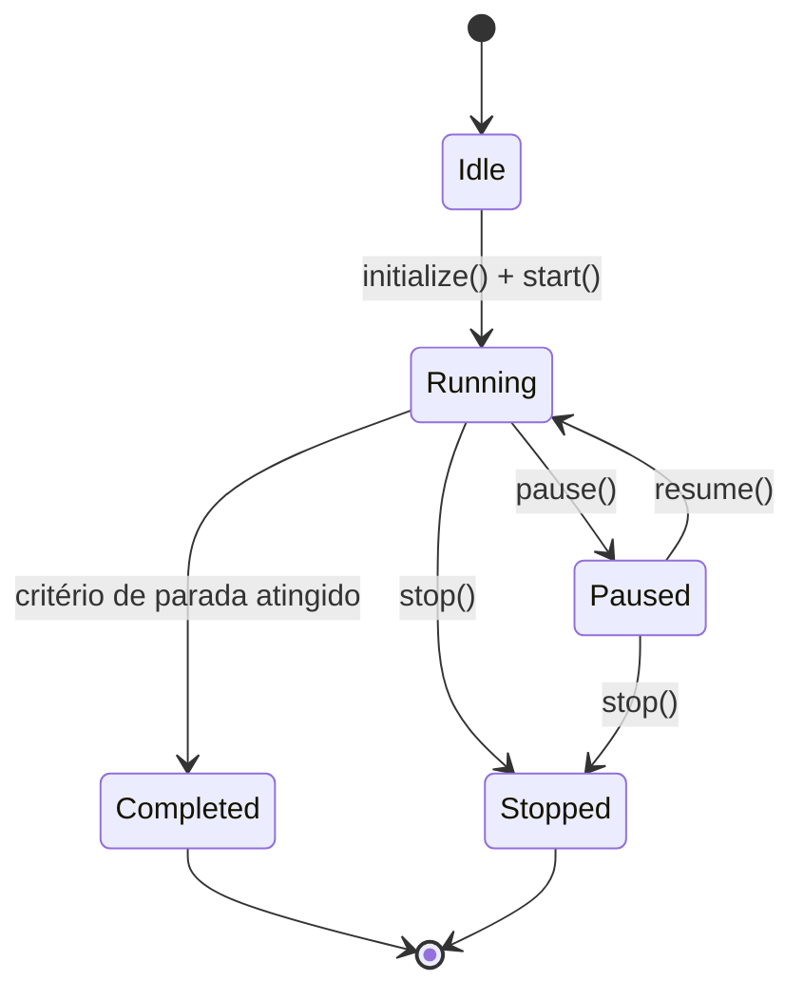
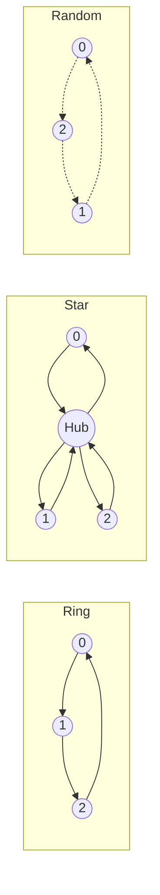

# AEGIS — Adaptive Evolutionary Guided Identification System

> **Identificação de sistemas dinâmicos não-lineares via Evolução Diferencial com modelo de ilhas, mutação adaptativa JADE e interface de agente inteligente.**

AEGIS é uma ferramenta web construída em Flutter/Dart que identifica automaticamente modelos NARX (*Nonlinear AutoRegressive with eXogenous inputs*) polinomiais e racionais a partir de dados experimentais. O motor evolutivo utiliza um arquipélago de populações com migração topológica, estratégias adaptativas JADE e avaliação por ERR com pseudo-linearização, tudo orquestrado por um painel de agente com 34 indicadores em tempo real e 12 parâmetros ajustáveis durante a execução.

---

## Sumário

1. [Visão Geral](#1-visão-geral)
2. [Arquitetura do Sistema](#2-arquitetura-do-sistema)
3. [Modelo NARX](#3-modelo-narx)
4. [Codificação Cromossômica](#4-codificação-cromossômica)
5. [Pré-processamento de Dados](#5-pré-processamento-de-dados)
6. [Motor de Evolução Diferencial](#6-motor-de-evolução-diferencial)
7. [Estratégias de Mutação](#7-estratégias-de-mutação)
8. [Operadores de Crossover](#8-operadores-de-crossover)
9. [Avaliação de Fitness](#9-avaliação-de-fitness)
10. [Modelo de Ilhas e Migração](#10-modelo-de-ilhas-e-migração)
11. [Critérios de Parada](#11-critérios-de-parada)
12. [Validação do Modelo](#12-validação-do-modelo)
13. [Sistema de Agente](#13-sistema-de-agente)
14. [Interface do Usuário](#14-interface-do-usuário)
15. [Fluxograma Completo](#15-fluxograma-completo)
16. [Estrutura do Projeto](#16-estrutura-do-projeto)
17. [Build e Execução](#17-build-e-execução)
18. [Referências](#18-referências)

---

## 1. Visão Geral

AEGIS resolve o problema de **identificação de sistemas** — dado um conjunto de dados entrada/saída $\{u(k), y(k)\}_{k=1}^{N}$, encontrar automaticamente:

- A **estrutura** do modelo (quais termos, atrasos e expoentes).
- Os **coeficientes** $\theta_j$ de cada regressor.
- O **grau de confiança** da representação (métricas de qualidade).

O processo é inteiramente automatizado: o usuário carrega dados, atribui variáveis de entrada/saída, e o motor evolutivo descobre o melhor modelo NARX sem intervenção manual.

---

## 2. Arquitetura do Sistema

```
┌──────────────────────────────────────────────────────────────────────┐
│                           AEGIS v2.0                                 │
├──────────────────────────────────────────────────────────────────────┤
│  ┌─────────────┐  ┌──────────────┐  ┌──────────────┐  ┌──────────┐ │
│  │  Data Layer │  │ Engine Layer │  │ Agent Layer  │  │ UI Layer │ │
│  │             │  │              │  │              │  │          │ │
│  │ DataLoader  │→ │ DEEngine     │→ │ Snapshot     │→ │ Screens  │ │
│  │ Normalizer  │  │ Islands      │  │ History      │  │ Charts   │ │
│  │ Splitter    │  │ Migration    │  │ Tuning       │  │ State    │ │
│  └─────────────┘  └──────────────┘  └──────────────┘  └──────────┘ │
│                                                                      │
│  ┌─────────────────────────────────────────────────────────────────┐ │
│  │                        Core Layer                               │ │
│  │  Matrix (Float64List)  ·  QR Decomposition  ·  Types  ·  PRNG  │ │
│  └─────────────────────────────────────────────────────────────────┘ │
└──────────────────────────────────────────────────────────────────────┘
```

**Princípios de design:**

| Princípio | Aplicação |
|-----------|-----------|
| **S** — Single Responsibility | Cada classe resolve um único problema (ex: `ErrCalculator` apenas calcula ERR) |
| **O** — Open/Closed | Estratégias de mutação/crossover são interfaces abstratas extensíveis |
| **L** — Liskov Substitution | `BicFitness` e `AicFitness` são substituíveis via `FitnessEvaluator` |
| **I** — Interface Segregation | `MutationStrategy` e `CrossoverStrategy` são contratos mínimos |
| **D** — Dependency Inversion | `Island` depende de abstrações (`MutationStrategy`, `FitnessEvaluator`) |

---

## 3. Modelo NARX

### 3.1 Modelo Polinomial

O modelo NARX polinomial geral é:

$$y(k) = \sum_{j=1}^{n_\theta} \theta_j \prod_{m=1}^{p_j} x_{i_m}(k - \tau_m)^{\alpha_m} + e(k)$$

onde:
- $y(k)$ é a saída no instante $k$
- $x_{i_m}$ é a variável de índice $i_m$ (entrada $u$ ou saída $y$)
- $\tau_m \geq 1$ é o atraso (delay)
- $\alpha_m \in \{0.5, 1.0, 1.5, \ldots, 5.0\}$ é o expoente (quantizado em passos de 0.5)
- $\theta_j$ é o coeficiente do $j$-ésimo regressor
- $n_\theta$ é o número de regressores selecionados
- $e(k)$ é o resíduo

**Exemplo concreto:**

$$y(k) = \theta_1 \cdot y(k-1) + \theta_2 \cdot u(k-1)^2 + \theta_3 \cdot u(k-2) \cdot y(k-3) + e(k)$$

### 3.2 Modelo Racional (com Pseudo-linearização)

Para representações racionais, o modelo assume a forma:

$$y(k) = \frac{\sum_{j \in \mathcal{N}} \theta_j \varphi_j(k)}{\displaystyle 1 + \sum_{j \in \mathcal{D}} \theta_j \varphi_j(k)}$$

onde $\mathcal{N}$ é o conjunto de regressores do numerador e $\mathcal{D}$ o do denominador.

A **pseudo-linearização** transforma este problema não-linear em linear:

$$y(k) = \sum_{j \in \mathcal{N}} \theta_j \varphi_j(k) - \sum_{j \in \mathcal{D}} \theta_j \cdot y(k) \cdot \varphi_j(k)$$

Definindo o vetor de regressores estendido:

$$\psi_j(k) = \begin{cases} \varphi_j(k) & \text{se } j \in \mathcal{N} \text{ (numerador)} \\ -y(k) \cdot \varphi_j(k) & \text{se } j \in \mathcal{D} \text{ (denominador)} \end{cases}$$

---

## 4. Codificação Cromossômica

Cada indivíduo (cromossomo) codifica uma estrutura de modelo candidata:

```
Chromosome
├── regressors: List<Regressor>        // Estrutura do modelo
│   └── Regressor
│       └── components: List<CompoundTerm>
│           └── CompoundTerm
│               ├── term: Term
│               │   ├── variable: int      // Índice da variável (0..n-1)
│               │   ├── delay: int         // Atraso temporal τ ≥ 1
│               │   └── isDenominator: bool // Numerador ou denominador
│               └── exponent: double       // α ∈ [0.5, 5.0]
├── coefficients: List<double>?        // θ estimados via QR (null se não avaliado)
├── err: List<double>?                 // ERR por regressor
├── fitness: double                    // BIC/AIC (NaN se não avaliado)
├── sse: double                        // Soma dos erros quadráticos
├── outputIndex: int                   // Índice da saída (para MIMO)
└── maxDelay: int                      // max(τ) entre todos os termos
```

O cromossomo é **imutável** — atualizações produzem novas instâncias via `withEvaluation()` e `withRegressors()`.

**Hash estrutural:** cada `Regressor` possui um hash combinatório para detecção eficiente de duplicatas na população:

$$h(R) = \bigoplus_{(t, \alpha) \in R} \text{hash}(t.\text{variable}, t.\text{delay}, \alpha)$$

---

## 5. Pré-processamento de Dados

### 5.1 Carregamento

O `DataLoader` suporta múltiplos formatos com auto-detecção:

| Formato | Separadores | Detecção |
|---------|-------------|----------|
| CSV | `,` | Contagem de ocorrências |
| TSV | `\t` | Contagem de ocorrências |
| Espaço | ` ` | Fallback |
| Ponto-e-vírgula | `;` | Contagem de ocorrências |

Opções: linha de cabeçalho (toggle), seleção de colunas, preview dos primeiros 10 registros.

### 5.2 Normalização Min-Max

Cada coluna $j$ é normalizada independentemente:

$$x_{norm}^{(j)} = L + \frac{R \cdot (x^{(j)} - x_{min}^{(j)})}{x_{max}^{(j)} - x_{min}^{(j)}}$$

com $L = 0.01$, $R = 0.99$, resultando em $x_{norm} \in [0.01, 1.0]$.

O intervalo evita o zero (que anularia termos multiplicativos) e preserva a escala relativa entre amostras.

### 5.3 Particionamento Sequencial

Os dados são divididos **sequencialmente** (preservando a ordem temporal):

| Partição | Proporção | Uso |
|----------|-----------|-----|
| Treino | 70% | Estimação de parâmetros $\theta$ |
| Validação | 15% | Seleção de modelo (early stopping) |
| Teste | 15% | Avaliação final (não vista pelo motor) |

---

## 6. Motor de Evolução Diferencial

### 6.1 Máquina de Estados



### 6.2 Execução em Lotes (Batch)

Para não bloquear a thread de UI, o motor executa em lotes de `generationsPerBatch` gerações (padrão: 10) com um `Timer.periodic` de 16 ms (~60 fps):

```
Timer(16ms) → runBatch(10 gens) → yield → Timer(16ms) → runBatch(10 gens) → ...
```

Cada chamada a `runBatch()`:

1. Executa 1 geração em **cada ilha**
2. Verifica se é hora de migração
3. Constrói `GenerationSnapshot` com 34 indicadores
4. Checa critérios de parada compostos
5. Retorna `true` (continuar) ou `false` (parar)

### 6.3 Ciclo de Uma Geração (por ilha)

Para cada indivíduo $i \in \{0, \ldots, NP-1\}$:

1. **Gerar parâmetros adaptativos** $F_i$, $CR_i$ via JADE
2. **Mutação** → vetor mutante $\mathbf{v}_i$
3. **Crossover** → vetor trial $\mathbf{u}_i$
4. **Construir matriz de regressores** $\Psi$ para o trial
5. **Avaliar** → coeficientes $\theta$ via QR, fitness via BIC
6. **Seleção greedy**: se $f(\mathbf{u}_i) < f(\mathbf{x}_i)$, substituir
7. Se aceito, registrar $F_i$, $CR_i$ como bem-sucedidos

Ao final da geração:
- Atualizar $\mu_F$, $\mu_{CR}$ via JADE
- Atualizar contador de estagnação

---

## 7. Estratégias de Mutação

### 7.1 DE/rand/1

$$\mathbf{v}_i = \mathbf{x}_{r_0} + F \cdot (\mathbf{x}_{r_1} - \mathbf{x}_{r_2})$$

onde $r_0, r_1, r_2$ são índices distintos escolhidos aleatoriamente, $r_j \neq i$.

**Operação no nível de regressores:** a mutação atua sobre os expoentes dos `CompoundTerm`:

$$\alpha_j^{(v)} = \text{clamp}\!\left(\alpha_j^{(r_0)} + F \cdot (\alpha_j^{(r_1)} - \alpha_j^{(r_2)}),\; 0.5,\; 5.0\right)$$

com quantização:

$$\alpha \leftarrow \frac{\lfloor 2\alpha \rfloor}{2} \quad \text{(passos de 0.5)}$$

### 7.2 JADE — DE/current-to-pbest/1

$$\mathbf{v}_i = \mathbf{x}_i + F_i \cdot (\mathbf{x}_{p\text{-best}} - \mathbf{x}_i) + F_i \cdot (\mathbf{x}_{r_1} - \mathbf{x}_{r_2})$$

onde $\mathbf{x}_{p\text{-best}}$ é selecionado aleatoriamente entre os top-$p$ indivíduos:

$$p = \max\!\left(2,\; \lfloor 0.05 \cdot NP \rfloor\right)$$

**Parâmetros adaptativos por indivíduo:**

- $F_i \sim \text{Cauchy}(\mu_F, 0.1)$, truncado em $[0, 1]$

$$f_{\text{Cauchy}}(x; \mu, \gamma) = \frac{1}{\pi\gamma\left[1 + \left(\frac{x-\mu}{\gamma}\right)^2\right]}$$

- $CR_i \sim \mathcal{N}(\mu_{CR}, 0.1)$, truncado em $[0, 1]$

**Atualização ao final da geração:**

Dado o conjunto de parâmetros bem-sucedidos $S_F = \{F_i : \text{trial}_i \text{ aceito}\}$:

$$\mu_F \leftarrow (1 - c)\,\mu_F + c \cdot \text{mean}_L(S_F)$$

onde $\text{mean}_L$ é a **média de Lehmer**:

$$\text{mean}_L(S_F) = \frac{\sum_{F \in S_F} F^2}{\sum_{F \in S_F} F}$$

Para $CR$:

$$\mu_{CR} \leftarrow (1 - c)\,\mu_{CR} + c \cdot \overline{S_{CR}}$$

com $c = 0.1$ (taxa de adaptação). Valores iniciais: $\mu_F = 0.5$, $\mu_{CR} = 0.5$.

---

## 8. Operadores de Crossover

### 8.1 Crossover Binomial (Uniforme)

Para cada gene $j \in \{1, \ldots, D\}$:

$$u_{i,j} = \begin{cases} v_{i,j} & \text{se } \text{rand}_j < CR \text{ ou } j = j_{\text{rand}} \\ x_{i,j} & \text{caso contrário} \end{cases}$$

onde $j_{\text{rand}} \sim \text{Uniforme}\{1,\ldots,D\}$ garante que pelo menos um gene vem do mutante.

### 8.2 Crossover Exponencial (Segmentado)

Seleciona um ponto inicial $L$ e copia um segmento contíguo do mutante:

$$u_{i,j} = \begin{cases} v_{i,j} & \text{se } j \in [L, L+n) \mod D \\ x_{i,j} & \text{caso contrário} \end{cases}$$

onde $n$ é o comprimento do segmento, controlado por $CR$: a cada posição, continua com probabilidade $CR$.

---

## 9. Avaliação de Fitness

### 9.1 Construção da Matriz de Regressores

Para um cromossomo com $k$ regressores e dados com $N$ amostras e atraso máximo $\tau_{\max}$:

$$\Psi \in \mathbb{R}^{(N - \tau_{\max}) \times k}$$

$$\psi_{t,j} = \prod_{(x_i, \tau_m, \alpha_m) \in R_j} x_i(t - \tau_m)^{\alpha_m}$$

Para regressores de denominador (modelo racional), aplica-se pseudo-linearização:

$$\psi_{t,j} \leftarrow -y(t) \cdot \psi_{t,j} \quad \text{se } R_j \in \mathcal{D}$$

### 9.2 Estimação de Coeficientes via QR

Os coeficientes $\theta$ são estimados por mínimos quadrados:

$$\Psi\,\theta = \mathbf{y} \implies \theta = (\Psi^T\Psi)^{-1}\Psi^T\mathbf{y}$$

Resolvido numericamente via decomposição QR (Modified Gram-Schmidt):

1. $\Psi = Q R$ onde $Q^TQ = I$, $R$ triangular superior
2. $R\,\theta = Q^T\mathbf{y}$
3. $\theta$ obtido por **back-substitution**:

$$\theta_i = \frac{(Q^T\mathbf{y})_i - \sum_{j=i+1}^{k} R_{ij}\,\theta_j}{R_{ii}}$$

### 9.3 ERR — Error Reduction Ratio

Cada regressor é avaliado pela fração da variância da saída que ele explica:

$$\text{ERR}_j = \frac{(\mathbf{q}_j^T \mathbf{y})^2}{(\mathbf{q}_j^T \mathbf{q}_j)(\mathbf{y}^T \mathbf{y})}$$

onde $\mathbf{q}_j$ é a $j$-ésima coluna ortogonalizada (do QR de $\Psi$).

A soma total:

$$\sum_{j=1}^{k} \text{ERR}_j \leq 1$$

indica a fração explicada. Valores próximos de 1 indicam modelo completo.

### 9.4 Critérios de Informação

**BIC** (Bayesian Information Criterion):

$$\text{BIC} = n \cdot \ln\!\left(\frac{SSE}{n}\right) + k \cdot \ln(n)$$

**AIC** (Akaike Information Criterion):

$$\text{AIC} = n \cdot \ln\!\left(\frac{SSE}{n}\right) + 2k$$

onde:
- $n$ = número de amostras efetivas $(N - \tau_{\max})$
- $k$ = número de regressores (parâmetros)
- $SSE = \sum_{t=1}^{n} (y(t) - \hat{y}(t))^2$

O BIC penaliza mais fortemente a complexidade para $n > e^2 \approx 7.4$, favorecendo modelos parcimoniosos.

---

## 10. Modelo de Ilhas e Migração

### 10.1 Arquipélago

O motor mantém $N_I$ ilhas independentes, cada uma com:

- RNG próprio: `seed = timestamp + id × 7919`
- Estratégia de mutação (JADE por padrão)
- População de $NP$ cromossomos
- Parâmetros adaptativos $\mu_F$, $\mu_{CR}$ independentes
- Contador de estagnação isolado

A diversidade entre ilhas é mantida pela inicialização independente e pela migração periódica.

### 10.2 Topologias de Migração



| Topologia | Mecanismo | Característica |
|-----------|-----------|----------------|
| **Ring** | Ilha $i$ envia para ilha $(i+1) \bmod N_I$ | Propagação gradual, balanceada |
| **Star** | Melhor ilha distribui para todas | Convergência rápida, centralizado |
| **Random** | Pares aleatórios | Máxima exploração |

### 10.3 Protocolo de Migração

- **Período:** a cada `migrationInterval` gerações (padrão: 20)
- **Número de migrantes:** $\lfloor 0.1 \times NP \rfloor$, limitado a $[1, 5]$
- **Seleção:** melhores indivíduos da ilha de origem
- **Substituição:** piores indivíduos da ilha de destino
- **Impacto:** registrado em `migrationImpact` no snapshot

---

## 11. Critérios de Parada

Cinco critérios independentes combinados via `CompositeCriterion` (qualquer um dispara a parada):

| Critério | Condição | Padrão | Descrição |
|----------|----------|--------|-----------|
| **MaxGenerations** | $g \geq g_{\max}$ | 5000 | Limite absoluto de gerações |
| **StagnationLimit** | $s \geq s_{\max}$ | 500 | Gerações sem melhoria no melhor fitness |
| **PopulationVariance** | $\sigma^2(f) < \epsilon \;\wedge\; g > 10$ | $\epsilon = 10^{-10}$ | Convergência prematura |
| **RelativeImprovement** | $\left\lvert\frac{f_g - f_{g-w}}{f_{g-w}}\right\rvert < \delta$ | $\delta = 10^{-8}$, $w = 50$ | Melhoria marginal |
| **TimeLimit** | $t_{\text{elapsed}} \geq t_{\max}$ | configurável | Tempo de execução |

Composição:

$$\text{shouldStop} = \bigvee_{c \in \mathcal{C}} c.\text{shouldStop}(\text{context})$$

---

## 12. Validação do Modelo

### 12.1 RMSE (Root Mean Square Error)

$$\text{RMSE} = \sqrt{\frac{1}{n}\sum_{t=1}^{n}(y(t) - \hat{y}(t))^2}$$

### 12.2 Coeficiente de Determinação $R^2$

$$R^2 = 1 - \frac{SS_{\text{res}}}{SS_{\text{tot}}} = 1 - \frac{\sum(y_t - \hat{y}_t)^2}{\sum(y_t - \bar{y})^2}$$

- $R^2 = 1$: ajuste perfeito
- $R^2 = 0$: modelo equivalente à média
- $R^2 < 0$: modelo pior que a média

### 12.3 Análise de Resíduos

Os resíduos $e(t) = y(t) - \hat{y}(t)$ devem ser ruído branco. A autocorrelação normalizada:

$$\rho_\ell = \frac{\sum_{t=1}^{n-\ell}(e_t - \bar{e})(e_{t+\ell} - \bar{e})}{\sum_{t=1}^{n}(e_t - \bar{e})^2}, \quad \ell = 0, 1, \ldots, L_{\max}$$

com $\rho_0 = 1$ por construção. O intervalo de confiança de 95% é:

$$\pm \frac{1.96}{\sqrt{n}}$$

Valores de $\rho_\ell$ dentro das bandas indicam resíduos não correlacionados (modelo adequado).

---

## 13. Sistema de Agente

### 13.1 GenerationSnapshot — 34 Indicadores

Cada geração produz um snapshot com os seguintes campos:

| Grupo | Indicador | Tipo | Descrição |
|-------|-----------|------|-----------|
| **Identificação** | `generation` | `int` | Número da geração atual |
| | `elapsed` | `Duration` | Tempo desde início |
| **Fitness Global** | `bestFitness` | `double` | Melhor fitness (min BIC) |
| | `worstFitness` | `double` | Pior fitness |
| | `meanFitness` | `double` | Média de fitness |
| | `medianFitness` | `double` | Mediana de fitness |
| | `stdDevFitness` | `double` | Desvio-padrão $\sigma$ |
| | `q1Fitness` | `double` | Primeiro quartil (P25) |
| | `q3Fitness` | `double` | Terceiro quartil (P75) |
| **Melhoria** | `improvementAbsolute` | `double` | $\Delta f = f_{g-1} - f_g$ |
| | `improvementRelative` | `double` | $\Delta f / \lvert f_{g-1}\rvert$ |
| | `improvementRate5` | `double` | Taxa de melhoria (janela 5) |
| | `improvementRate20` | `double` | Taxa de melhoria (janela 20) |
| **Convergência** | `stagnationCounter` | `int` | Gerações sem melhoria |
| | `populationVariance` | `double` | $\sigma^2$ do fitness |
| | `successRate` | `double` | Fração de trials aceitos |
| | `successRateHistory` | `List<double>` | Histórico de taxas |
| | `uniqueStructures` | `int` | Estruturas cromossômicas distintas |
| **Diversidade** | `structureEntropy` | `double` | Entropia de Shannon (hashes) |
| | `phenotypicDiversity` | `double` | $\sigma$ no espaço de fitness |
| **Melhor Modelo** | `bestModelComplexity` | `int` | Número de regressores |
| | `bestModelMaxDegree` | `double` | Maior expoente |
| | `bestModelMaxDelay` | `int` | Maior atraso $\tau$ |
| | `bestModelERR` | `List<double>` | Vetor ERR por regressor |
| | `bestModelRMSE` | `double` | RMSE no treino |
| | `bestModelValidationRMSE` | `double?` | RMSE na validação |
| | `bestModelR2` | `double` | $R^2$ no treino |
| | `residualAutocorrelation` | `List<double>?` | $\rho_\ell$ até lag 20 |
| **Topologia** | `islandSnapshots` | `List<IslandSnapshot>` | Dados por ilha |
| | `migrationImpact` | `double?` | Melhoria pós-migração |
| **Frequência** | `regressorFrequency` | `Map<int, double>` | Histograma de termos |

### 13.2 IslandSnapshot (por ilha)

| Campo | Descrição |
|-------|-----------|
| `islandId` | Identificador da ilha |
| `generation` | Geração local |
| `stats` | `PopulationStats` (best/worst/mean/median/stdDev/q1/q3/uniqueStructures/entropy) |
| `bestChromosome` | Melhor indivíduo local |
| `stagnationCounter` | Estagnação local |
| `successRate` | Taxa de aceitação local |
| `muF` | Parâmetro JADE $\mu_F$ atual |
| `muCR` | Parâmetro JADE $\mu_{CR}$ atual |

### 13.3 Parâmetros Ajustáveis em Tempo Real

| # | Parâmetro | Min | Padrão | Max | Tipo | Escopo |
|---|-----------|-----|--------|-----|------|--------|
| 1 | `mutationFactor` ($F$) | 0.0 | **0.5** | 2.0 | contínuo | global |
| 2 | `crossoverRate` ($CR$) | 0.0 | **0.9** | 1.0 | contínuo | global |
| 3 | `populationSize` ($NP$) | 20 | **50** | 500 | inteiro | per-island |
| 4 | `elitismCount` | 0 | **2** | 20 | inteiro | global |
| 5 | `migrationInterval` | 5 | **20** | 100 | inteiro | global |
| 6 | `migrationRate` | 0.0 | **0.1** | 0.3 | contínuo | global |
| 7 | `maxRegressors` | 2 | **8** | 20 | inteiro | global |
| 8 | `maxExponent` ($\alpha_{\max}$) | 1 | **3** | 5 | contínuo | global |
| 9 | `maxDelay` ($\tau_{\max}$) | 1 | **20** | 50 | inteiro | global |
| 10 | `complexityPenalty` | 0.0 | **1.0** | 10.0 | contínuo | global |
| 11 | `stagnationLimit` | 50 | **500** | 5000 | inteiro | global |
| 12 | `reinitializationRatio` | 0.0 | **0.1** | 0.5 | contínuo | global |

Cada slider permite ajustar o parâmetro durante a execução. A ação é registrada no histórico (`TuningAction`) e aplicada na próxima geração.

---

## 14. Interface do Usuário

### 14.1 Layout Responsivo

| Viewport | Navegação | Breakpoint |
|----------|-----------|-----------|
| Desktop grande | `NavigationRail` expandido (com labels) | ≥ 1200 px |
| Desktop / Tablet | `NavigationRail` colapsado (apenas ícones) | ≥ 768 px |
| Mobile | `BottomNavigationBar` | < 768 px |

### 14.2 Telas

| Tela | Função | Componentes Principais |
|------|--------|----------------------|
| **Data** | Carga e atribuição de variáveis | File picker, toggle header, seletor de separador, tabela preview, atribuição input/output por clique |
| **Evolution** | Monitoramento da evolução em tempo real | Controles (Start/Pause/Resume/Stop), KPIs (Geração, Fitness, $R^2$, Tempo), gráfico de fitness (fl_chart), métricas detalhadas |
| **Agent** | Painel de controle do agente | Grid de 12 indicadores com cor semântica, sliders de tuning com reset, monitor de ilhas (barras), gráfico de contribuição ERR |
| **Results** | Modelo identificado final | Equação matemática (monospace selecionável), métricas de qualidade, tabela ERR/coeficientes, autocorrelação com bandas de confiança, resumo da execução |

### 14.3 Paleta de Cores

Tema escuro com tons de cinza frio e acento cyan:

| Token | Hex | Uso |
|-------|-----|-----|
| `gray950` | `#0A0A0F` | Fundo principal |
| `gray900` | `#131318` | Superfície de cards |
| `gray850` | `#1C1C24` | Superfície elevada |
| `gray800` | `#25252F` | Bordas e separadores |
| `gray750` | `#2F2F3A` | Trilhas de sliders |
| `gray700` | `#3A3A47` | Hover |
| `gray600` | `#4E4E5C` | Texto desabilitado |
| `gray500` | `#636373` | Texto terciário |
| `gray400` | `#8585A0` | Labels |
| `gray300` | `#A0A0B8` | Texto secundário |
| `gray200` | `#C0C0D0` | Texto principal |
| `gray100` | `#D8D8E4` | Ícones |
| `gray50` | `#F4F4F8` | Texto de destaque |
| `accent` | `#5EC4D4` | Cor de acento (cyan) |
| `accentSubtle` | `#5EC4D4` α30% | Fundo de acento |
| `success` | `#4ADE80` | Indicadores positivos |
| `warning` | `#FBBF24` | Alertas |
| `error` | `#F87171` | Erros |
| `info` | `#60A5FA` | Informacional |

---

## 15. Fluxograma Completo

```mermaid
flowchart TB
    A[/"📂 Carregar arquivo CSV / TSV"/] --> B["Parsing automático<br/>(auto-detect separador)"]
    B --> C["Atribuir variáveis<br/>Inputs (u) / Output (y)"]
    C --> D["Normalização Min-Max<br/>x ∈ [0.01, 1.0]"]
    D --> E["Particionamento<br/>70% treino · 15% val · 15% teste"]
    E --> F["Inicializar Motor DE"]
    
    F --> G["Criar N ilhas<br/>RNG independente por ilha"]
    G --> H["Gerar populações aleatórias<br/>ChromosomeFactory"]
    
    H --> I{{"Loop de Gerações<br/>g = 1, 2, ..., g_max"}}
    
    I --> J["Para cada Ilha i"]
    
    J --> K["Para cada indivíduo j"]
    K --> L["JADE: gerar F_j ~ Cauchy(μF, 0.1)<br/>CR_j ~ N(μCR, 0.1)"]
    L --> M["Mutação:<br/>DE/current-to-pbest/1"]
    M --> N["Crossover:<br/>Binomial ou Exponencial"]
    N --> O["Construir Ψ<br/>(RegressorBuilder)"]
    O --> P["QR (Gram-Schmidt) → θ<br/>SSE, ERR, BIC"]
    P --> Q{"fitness(trial)<br/>< fitness(target)?"}
    
    Q -->|Sim| R["Aceitar trial<br/>Registrar (F_j, CR_j) em S"]
    Q -->|Não| S["Manter target"]
    
    R --> T["Próximo indivíduo"]
    S --> T
    T --> K
    
    T -->|Todos processados| U["JADE Adaptation<br/>μF ← Lehmer(S_F)<br/>μCR ← Mean(S_CR)"]
    U --> V["Atualizar estagnação"]
    V --> J
    
    V -->|Todas ilhas| W{"g mod 20 = 0?"}
    W -->|Sim| X["Migração<br/>(Ring / Star / Random)"]
    W -->|Não| Y["Construir Snapshot<br/>(34 indicadores)"]
    X --> Y
    
    Y --> Z["Emitir para UI<br/>+ Agent Dashboard"]
    
    Z --> AA{"Critério de<br/>parada?"}
    AA -->|Não| I
    AA -->|Sim| AB["Selecionar melhor modelo<br/>global entre todas as ilhas"]
    
    AB --> AC["Validação final<br/>RMSE, R², Autocorrelação"]
    AC --> AD[/"📊 Exibir Resultados<br/>Equação · Métricas · Gráficos"/]
    
    style A fill:#1a1a2e,stroke:#5EC4D4,color:#F4F4F8
    style AD fill:#1a1a2e,stroke:#4ADE80,color:#F4F4F8
    style Q fill:#2a2a3e,stroke:#FBBF24,color:#F4F4F8
    style AA fill:#2a2a3e,stroke:#FBBF24,color:#F4F4F8
    style W fill:#2a2a3e,stroke:#60A5FA,color:#F4F4F8
    style I fill:#1a1a2e,stroke:#F87171,color:#F4F4F8
```



---

## 16. Estrutura do Projeto

```
lib/
├── main.dart                              # Ponto de entrada (AegisApp)
│
├── core/                                  # Fundações matemáticas e tipos
│   ├── math/
│   │   ├── matrix.dart                    # Matriz column-major (Float64List)
│   │   ├── matrix_view.dart               # View imutável sobre Matrix
│   │   ├── decomposition.dart             # QR (Gram-Schmidt + Householder)
│   │   └── math.dart                      # Barrel export
│   ├── types/
│   │   ├── term.dart                      # Term (variável, delay, isDenom)
│   │   ├── regressor.dart                 # CompoundTerm + Regressor
│   │   ├── chromosome.dart                # Cromossomo imutável
│   │   ├── narx_model.dart                # Modelo final identificado
│   │   └── types.dart                     # Barrel export
│   └── random/
│       └── xorshift128.dart               # PRNG (wrapper dart:math p/ web)
│
├── engine/                                # Motor de otimização
│   ├── fitness/
│   │   ├── fitness_evaluator.dart         # Interface abstrata
│   │   ├── bic_fitness.dart               # BIC + AIC (com QR integrado)
│   │   └── err_calculator.dart            # ERR com pseudo-linearização
│   ├── de/
│   │   ├── strategies/
│   │   │   ├── mutation_strategy.dart     # Interface + MutationParams
│   │   │   ├── de_rand_1.dart             # DE/rand/1
│   │   │   ├── jade_mutation.dart         # JADE adaptativo
│   │   │   ├── crossover_strategy.dart    # Binomial + Exponencial
│   │   │   └── strategies.dart            # Barrel export
│   │   ├── chromosome_factory.dart        # Geração de cromossomos aleatórios
│   │   ├── population.dart                # Gerenciamento de população
│   │   ├── island.dart                    # Ilha DE completa
│   │   ├── regressor_builder.dart         # Construção de Ψ a partir de dados
│   │   ├── migration.dart                 # Migração Ring/Star/Random
│   │   └── de_engine.dart                 # Orquestrador principal
│   ├── identification/
│   │   ├── data_normalizer.dart           # Normalização min-max [0.01, 1.0]
│   │   ├── data_splitter.dart             # Split sequencial 70/15/15
│   │   └── model_validator.dart           # RMSE, R², resíduos
│   └── stopping/
│       └── stopping_criterion.dart        # 5 critérios + composição
│
├── agent/                                 # Sistema de monitoramento inteligente
│   ├── generation_snapshot.dart           # Snapshot com 34 indicadores
│   ├── tunable_parameter.dart             # 12 parâmetros + ParameterRegistry
│   └── generation_history.dart            # Histórico + TuningAction
│
├── data/
│   └── data_loader.dart                   # Parsing CSV/TSV/espaço com auto-detect
│
└── ui/                                    # Interface Flutter
    ├── theme/
    │   └── app_theme.dart                 # Paleta cinza frio + cyan accent
    ├── state/
    │   └── app_state.dart                 # Riverpod (EngineNotifier + providers)
    ├── screens/
    │   ├── home_screen.dart               # Shell responsivo (Rail/BottomNav)
    │   ├── data_screen.dart               # Carga e atribuição de dados
    │   ├── evolution_screen.dart          # Monitoramento em tempo real
    │   ├── agent_dashboard_screen.dart    # Dashboard do agente
    │   └── results_screen.dart            # Modelo final e diagnósticos
    └── widgets/
        └── stat_card.dart                 # StatCard + MiniStat
```

---

## 17. Build e Execução

### Pré-requisitos

- Flutter SDK ≥ 3.27
- Dart SDK ≥ 3.11

### Comandos

```bash
# Instalar dependências
flutter pub get

# Análise estática (deve retornar zero issues)
dart analyze lib

# Build web (release)
flutter build web --release

# Executar no navegador
flutter run -d chrome

# Build WASM (experimental)
flutter build web --wasm
```

### Dependências

| Pacote | Versão | Uso |
|--------|--------|-----|
| `flutter_riverpod` | ^2.6.1 | Gerenciamento de estado reativo |
| `fl_chart` | ^0.70.2 | Gráficos de fitness e ERR |
| `file_picker` | ^8.1.6 | Seleção de arquivos CSV/TSV |
| `google_fonts` | ^6.2.1 | Tipografia (Inter) |
| `lucide_icons` | ^0.257.0 | Iconografia |
| `collection` | ^1.19.1 | Utilitários de coleções |

---

## 18. Referências

1. **Zhang, J. & Sanderson, A. C.** (2009). JADE: Adaptive Differential Evolution with Optional External Archive. *IEEE Trans. Evolutionary Computation*, 13(5), 945–958.

2. **Billings, S. A.** (2013). *Nonlinear System Identification: NARMAX Methods in the Time, Frequency, and Spatio-Temporal Domains*. Wiley.

3. **Chen, S., Billings, S. A. & Luo, W.** (1989). Orthogonal Least Squares Methods and their Application to Non-Linear System Identification. *Int. J. Control*, 50(5), 1873–1896.

4. **Storn, R. & Price, K.** (1997). Differential Evolution — A Simple and Efficient Heuristic for Global Optimization over Continuous Spaces. *J. Global Optimization*, 11(4), 341–359.

5. **Schwarz, G.** (1978). Estimating the Dimension of a Model. *Ann. Statist.*, 6(2), 461–464.

---

<div align="center">

**AEGIS v2.0** · Adaptive Evolutionary Guided Identification System

*Construído com Flutter & Dart · Targeting Web (JS/WASM)*

</div>
