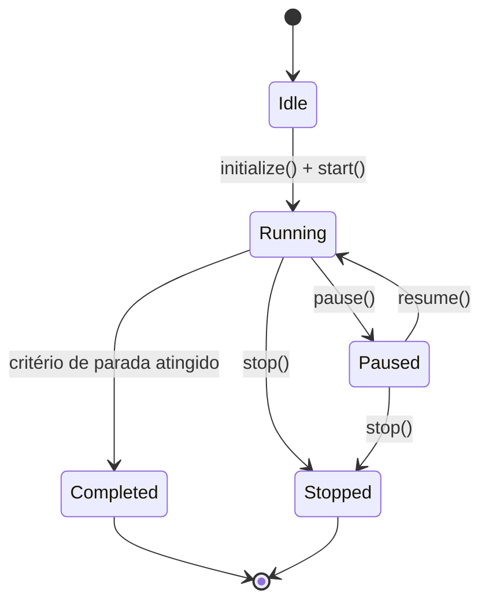

# AEGIS — Adaptive Evolutionary Guided Identification System

> **Identificação de sistemas dinâmicos não-lineares via Evolução Diferencial com modelo de ilhas, mutação adaptativa JADE, núcleo computacional em C++ e interface de agente LLM.**

AEGIS identifica automaticamente modelos NARX (*Nonlinear AutoRegressive with eXogenous inputs*) polinomiais e racionais a partir de dados experimentais. O núcleo computacional é uma biblioteca compartilhada C++ (`aegis_core`) compilada como DLL nativa no Windows e como WebAssembly na web, integrada a uma UI Flutter/Dart por uma camada FFI condicional. Um agente LLM alimentado pelo Claude monitora o motor evolutivo em tempo real e sugere ajustes de parâmetros via Anthropic API.

---

## Sumário

1. [Visão Geral](#1-visão-geral)
2. [Arquitetura do Sistema](#2-arquitetura-do-sistema)
3. [Modelo NARX](#3-modelo-narx)
4. [Codificação Cromossômica](#4-codificação-cromossômica)
5. [Pré-processamento de Dados](#5-pré-processamento-de-dados)
6. [Motor de Evolução Diferencial](#6-motor-de-evolução-diferencial)
7. [Estratégias de Mutação](#7-estratégias-de-mutação)
8. [Operadores de Crossover](#8-operadores-de-crossover)
9. [Avaliação de Fitness](#9-avaliação-de-fitness)
10. [Modelo de Ilhas e Migração](#10-modelo-de-ilhas-e-migração)
11. [Critérios de Parada](#11-critérios-de-parada)
12. [Validação e Diagnóstico do Modelo](#12-validação-e-diagnóstico-do-modelo)
13. [Sistema de Agente](#13-sistema-de-agente)
14. [Interface do Usuário](#14-interface-do-usuário)
15. [Fluxograma Completo](#15-fluxograma-completo)
16. [Estrutura do Projeto](#16-estrutura-do-projeto)
17. [Build e Execução](#17-build-e-execução)
18. [Referências](#18-referências)

---

## 1. Visão Geral

AEGIS resolve o problema de **identificação de sistemas** — dado um conjunto de dados entrada/saída $\{u(k), y(k)\}_{k=1}^{N}$, encontrar automaticamente:

- A **estrutura** do modelo (quais termos, atrasos e expoentes).
- Os **coeficientes** $\theta_j$ de cada regressor.
- O **grau de confiança** da representação (métricas de qualidade).

O processo é inteiramente automatizado: o usuário carrega dados, atribui variáveis de entrada/saída, e o motor evolutivo descobre o melhor modelo NARX sem intervenção manual.

---

## 2. Arquitetura do Sistema

### 2.1 Design Híbrido C++ / Flutter

| Camada | Plataforma | Componentes | Responsabilidade |
|--------|----------|-----------|------------------|
| **Núcleo C++** | Windows (DLL) / Web (WASM) | `IdentificationPipeline` · `DEOptimizer` · `RationalModel` · `LocalRefiner` · `AgentController` | Motor completo de identificação — DE, QR, diagnósticos, WebSocket |
| **Ponte FFI** | Dart | `AegisFfiService` (nativo) · `AegisWasmService` (web) | Traduz chamadas Dart ↔ ABI C (`aegis_api.h`) |
| **Motor Dart** | Todas as plataformas | `DEEngine` · `Island` · `Migration` | Fallback Dart puro quando C++ indisponível |
| **Agente LLM** | Windows (apenas nativo) | `LlmAgent` | Chama Claude API a cada 50 gerações para sugerir ajustes |
| **Camada de Agente** | Todas as plataformas | `GenerationSnapshot` · `ParameterRegistry` · `GenerationHistory` | Estruturas de dados de monitoramento em tempo real |
| **Camada de Dados** | Todas as plataformas | `DataLoader` · `DataNormalizer` · `DataSplitter` | Parsing, normalização, particionamento |
| **Camada UI** | Todas as plataformas | Screens · Charts · estado Riverpod | Interação e visualização |

**Seleção de backend em tempo de execução:**

| Plataforma | Motor de identificação | Agente LLM |
|------------|-----------------------|------------|
| Windows + `aegis_core.dll` | C++ via `dart:ffi` | Ativo (lê chave do env ou arquivo) |
| Windows sem DLL | Dart `DEEngine` (fallback) | Ativo |
| Web (GitHub Pages) | Dart `DEEngine` | Inativo (`dart:io` indisponível) |

`AegisLibrary.tryLoad()` é chamado em `main()`. Se o carregamento da DLL falhar, `EngineNotifier` usa silenciosamente o motor Dart. Na web, exports condicionais garantem que `dart:ffi`, `dart:io` e `package:ffi` **nunca são compilados**.

**Fluxo de dados:**

```
Camada de Dados → Núcleo C++ (ou Motor Dart) → Ponte FFI → EngineNotifier
       ↓                                                           ↓
  Snapshot (JSON via FFI / callback)                  LlmAgent (Claude API)
       ↓                                                           ↓
 Camada UI ← ← ← ← Riverpod ← ← ← ← ← applyTuning() ← ← ← ← ← ┘
```

### 2.2 Princípios de Design

| Princípio | Aplicação |
|-----------|-----------|
| **S** — Single Responsibility | Cada classe resolve um único problema (ex: `CollinearityAnalyzer` apenas calcula VIF) |
| **O** — Open/Closed | Estratégias de mutação/crossover são interfaces abstratas extensíveis |
| **L** — Liskov Substitution | `AegisFfiService` e `DEEngine` são intercambiáveis via `EngineNotifier` |
| **I** — Interface Segregation | `MutationStrategy` e `CrossoverStrategy` são contratos mínimos |
| **D** — Dependency Inversion | `EngineNotifier` depende do serviço abstrato FFI/Dart, não de tipos C++ concretos |

---

## 3. Modelo NARX

### 3.1 Modelo Polinomial

O modelo NARX polinomial geral é:

$$y(k) = \sum_{j=1}^{n_\theta} \theta_j \prod_{m=1}^{p_j} x_{i_m}(k - \tau_m)^{\alpha_m} + e(k)$$

onde:
- $y(k)$ é a saída no instante $k$
- $x_{i_m}$ é a variável de índice $i_m$ (entrada $u$ ou saída $y$)
- $\tau_m \geq 1$ é o atraso (delay)
- $\alpha_m \in [p_{\min}, p_{\max}]$ é o expoente (padrão $[0.5, 5.0]$ em passos de 0.5)
- $\theta_j$ é o coeficiente do $j$-ésimo regressor
- $n_\theta$ é o número de regressores selecionados
- $e(k)$ é o resíduo

**Exemplo concreto:**

$$y(k) = \theta_1 \cdot y(k-1) + \theta_2 \cdot u(k-1)^2 + \theta_3 \cdot u(k-2) \cdot y(k-3) + e(k)$$

### 3.2 Modelo Racional (com Pseudo-linearização)

Para representações racionais, o modelo assume a forma:

$$y(k) = \frac{\sum_{j \in \mathcal{N}} \theta_j \varphi_j(k)}{\displaystyle 1 + \sum_{j \in \mathcal{D}} \theta_j \varphi_j(k)}$$

onde $\mathcal{N}$ é o conjunto de regressores do numerador e $\mathcal{D}$ o do denominador.

A **pseudo-linearização** transforma este problema não-linear em linear:

$$y(k) = \sum_{j \in \mathcal{N}} \theta_j \varphi_j(k) - \sum_{j \in \mathcal{D}} \theta_j \cdot y(k) \cdot \varphi_j(k)$$

Definindo o vetor de regressores estendido:

$$\psi_j(k) = \begin{cases} \varphi_j(k) & \text{se } j \in \mathcal{N} \text{ (numerador)} \\ -y(k) \cdot \varphi_j(k) & \text{se } j \in \mathcal{D} \text{ (denominador)} \end{cases}$$

---

## 4. Codificação Cromossômica

Cada indivíduo (cromossomo) codifica uma estrutura de modelo candidata:

```
Cromossomo (lado C++: std::vector<Regressor>)
├── regressors[]
│   └── Regressor
│       ├── terms[]: { variable, delay, exponent, is_denominator }
│       └── coeficiente θ
├── fitness                    // pontuação composta (menor = melhor)
├── metrics: { rmse_train, rmse_val, r2, aic, bic, fpe, mdl, sse }
└── diagnostics: { stable, overfitting, underfitting, err[] }
```

O cromossomo do lado Dart (motor fallback) é **imutável** — atualizações produzem novas instâncias via `withEvaluation()` e `withRegressors()`.

**Hash estrutural:** cada regressor possui um hash combinatório para detecção eficiente de duplicatas:

$$h(R) = \bigoplus_{(t, \alpha) \in R} \text{hash}(t.\text{variable}, t.\text{delay}, \alpha)$$

---

## 5. Pré-processamento de Dados

### 5.1 Carregamento

O `DataLoader` suporta múltiplos formatos com auto-detecção:

| Formato | Separadores | Detecção |
|---------|-------------|----------|
| CSV | `,` | Contagem de ocorrências |
| TSV | `\t` | Contagem de ocorrências |
| Espaço | ` ` | Fallback |
| Ponto-e-vírgula | `;` | Contagem de ocorrências |

Opções: linha de cabeçalho (toggle), seleção de colunas, preview dos primeiros 10 registros.

### 5.2 Normalização

**C++ (`cpp/src/normalizer.cpp`):** Três estratégias selecionáveis via JSON config:

| Tipo | Chave JSON | Descrição |
|------|------------|-----------|
| Min-Max (padrão) | `"minmax"` | Escala para $[10^{-6}, 1.0]$ |
| Robusto | `"robust"` | Mediana + IQR — resistente a outliers |
| Z-score | `"zscore"` | Média zero, desvio padrão unitário |

**Dart fallback:** Min-Max com $L = 0.01$, $R = 0.99$, resultado $\in [0.01, 1.0]$.

### 5.3 Particionamento Sequencial

Os dados são divididos **sequencialmente** (preservando a ordem temporal):

| Partição | Proporção | Uso |
|----------|-----------|-----|
| Treino | 70% | Estimação de parâmetros $\theta$ |
| Validação | 15% | Seleção de modelo (early stopping) |
| Teste | 15% | Avaliação final (não vista pelo motor) |

---

## 6. Motor de Evolução Diferencial

### 6.1 Máquina de Estados



### 6.2 Modelo de Execução

**Motor C++:** Executa em threads de fundo (`std::thread` por ilha). A UI Dart faz polling via `Timer.periodic(200 ms)` chamando `aegis_get_snapshot()` / `aegis_get_status()` via FFI.

**Motor Dart (fallback):** Executa em lotes de 10 gerações por `Timer.periodic(16 ms)` para não bloquear a thread de UI.

### 6.3 Ciclo de Uma Geração (por ilha)

Para cada indivíduo $i \in \{0, \ldots, NP-1\}$:

1. **Gerar parâmetros adaptativos** $F_i$, $CR_i$ via JADE
2. **Mutação** → vetor mutante $\mathbf{v}_i$
3. **Crossover** → vetor trial $\mathbf{u}_i$
4. **Construir matriz de regressores** $\Psi$ para o trial
5. **Avaliar** → coeficientes $\theta$ via QR, fitness via pontuação composta
6. **Seleção greedy**: se $f(\mathbf{u}_i) < f(\mathbf{x}_i)$, substituir
7. Se aceito, registrar $F_i$, $CR_i$ como bem-sucedidos

Ao final da geração:
- Atualizar $\mu_F$, $\mu_{CR}$ via JADE
- Atualizar contador de estagnação

---

## 7. Estratégias de Mutação

### 7.1 DE/rand/1

$$\mathbf{v}_i = \mathbf{x}_{r_0} + F \cdot (\mathbf{x}_{r_1} - \mathbf{x}_{r_2})$$

onde $r_0, r_1, r_2$ são índices distintos escolhidos aleatoriamente, $r_j \neq i$.

**Operação no nível de regressores:** a mutação perturba expoentes e atrasos continuamente; variáveis mutam discretamente com ~10% de probabilidade.

$$\alpha_j^{(v)} = \text{clamp}\!\left(\alpha_j^{(r_0)} + F \cdot (\alpha_j^{(r_1)} - \alpha_j^{(r_2)}),\; p_{\min},\; p_{\max}\right)$$

### 7.2 JADE — DE/current-to-pbest/1

$$\mathbf{v}_i = \mathbf{x}_i + F_i \cdot (\mathbf{x}_{p\text{-best}} - \mathbf{x}_i) + F_i \cdot (\mathbf{x}_{r_1} - \mathbf{x}_{r_2})$$

onde $\mathbf{x}_{p\text{-best}}$ é selecionado aleatoriamente entre os top-$p$ indivíduos:

$$p = \max\!\left(2,\; \lfloor 0.05 \cdot NP \rfloor\right)$$

**Parâmetros adaptativos por indivíduo:**

- $F_i \sim \text{Cauchy}(\mu_F, 0.1)$, truncado em $(0, 2]$
- $CR_i \sim \mathcal{N}(\mu_{CR}, 0.1)$, truncado em $[0, 1]$

**Atualização ao final da geração:**

$$\mu_F \leftarrow (1 - c)\,\mu_F + c \cdot \text{mean}_L(S_F), \qquad \mu_{CR} \leftarrow (1 - c)\,\mu_{CR} + c \cdot \overline{S_{CR}}$$

onde $\text{mean}_L$ é a **média de Lehmer** e $c = 0.1$ (taxa de adaptação).

---

## 8. Operadores de Crossover

### 8.1 Crossover Binomial (Uniforme)

Para cada gene $j \in \{1, \ldots, D\}$:

$$u_{i,j} = \begin{cases} v_{i,j} & \text{se } \text{rand}_j < CR \text{ ou } j = j_{\text{rand}} \\ x_{i,j} & \text{caso contrário} \end{cases}$$

### 8.2 Crossover Exponencial (Segmentado)

Seleciona um ponto inicial $L$ e copia um segmento contíguo do mutante:

$$u_{i,j} = \begin{cases} v_{i,j} & \text{se } j \in [L, L+n) \mod D \\ x_{i,j} & \text{caso contrário} \end{cases}$$

onde $n$ é o comprimento do segmento, controlado por $CR$.

---

## 9. Avaliação de Fitness

### 9.1 Construção da Matriz de Regressores

Para um cromossomo com $k$ regressores e dados com $N$ amostras e atraso máximo $\tau_{\max}$:

$$\Psi \in \mathbb{R}^{(N - \tau_{\max}) \times k}$$

Para regressores de denominador (modelo racional), aplica-se pseudo-linearização:

$$\psi_{t,j} \leftarrow -y(t) \cdot \psi_{t,j} \quad \text{se } R_j \in \mathcal{D}$$

### 9.2 Estimação de Coeficientes via QR

Resolvido numericamente via decomposição QR (Householder no C++, Gram-Schmidt modificado no Dart):

$$\Psi\,\theta = \mathbf{y} \implies R\,\theta = Q^T\mathbf{y} \implies \theta_i = \frac{(Q^T\mathbf{y})_i - \sum_{j=i+1}^{k} R_{ij}\,\theta_j}{R_{ii}}$$

### 9.3 ERR — Error Reduction Ratio

$$\text{ERR}_j = \frac{(\mathbf{q}_j^T \mathbf{y})^2}{(\mathbf{q}_j^T \mathbf{q}_j)(\mathbf{y}^T \mathbf{y})}$$

onde $\mathbf{q}_j$ é a $j$-ésima coluna ortogonalizada (do QR de $\Psi$).

### 9.4 Fitness Composto

$$f = \text{RMSE}_{\text{val}} + \alpha \cdot \max(0, \text{BIC}) + \beta \cdot P_D + \gamma \cdot P_C + \delta \cdot P_E + \eta \cdot P_S$$

| Termo | Penalidade | Propósito |
|-------|-----------|-----------|
| $P_D$ | `denominatorPenalty` | Penaliza complexidade racional (denominador) |
| $P_C$ | `complexityPenalty` | Penaliza número de termos |
| $P_E$ | `exponentPenalty` | Penaliza expoentes distantes de 1.0 |
| $P_S$ | `stabilityPenalty` | Penaliza raízes do denominador fora do círculo unitário |

### 9.5 Critérios de Informação

**BIC** (Bayesian Information Criterion):

$$\text{BIC} = n \cdot \ln\!\left(\frac{SSE}{n}\right) + k \cdot \ln(n)$$

**AIC** (Akaike Information Criterion):

$$\text{AIC} = n \cdot \ln\!\left(\frac{SSE}{n}\right) + 2k$$

---

## 10. Modelo de Ilhas e Migração

### 10.1 Arquipélago

O motor mantém $N_I$ ilhas independentes, cada uma com seu próprio RNG, população de $NP$ cromossomos e parâmetros JADE independentes $\mu_F$, $\mu_{CR}$.

### 10.2 Topologias de Migração

| Topologia | Mecanismo | Característica |
|-----------|-----------|----------------|
| **Ring** | Ilha $i$ envia para ilha $(i+1) \bmod N_I$ | Propagação gradual, balanceada |
| **Star** | Melhor ilha distribui para todas | Convergência rápida, centralizado |
| **Random** | Pares aleatórios | Máxima exploração |

### 10.3 Protocolo de Migração

- **Período:** a cada `migrationInterval` gerações (padrão: 20)
- **Número de migrantes:** $\lfloor \text{migrationRate} \times NP \rfloor$, limitado a $[1, 5]$
- **Seleção:** melhores indivíduos da ilha de origem
- **Substituição:** piores indivíduos da ilha de destino

---

## 11. Critérios de Parada

Cinco critérios independentes combinados (qualquer um dispara a parada):

| Critério | Condição | Padrão |
|----------|----------|--------|
| **MaxGenerations** | $g \geq g_{\max}$ | 5000 |
| **StagnationLimit** | $s \geq s_{\max}$ | 500 |
| **PopulationVariance** | $\sigma^2(f) < \epsilon \;\wedge\; g > 10$ | $\epsilon = 10^{-10}$ |
| **RelativeImprovement** | $\lvert\Delta f / f_{g-w}\rvert < \delta$ | $\delta = 10^{-8}$, $w = 50$ |
| **TimeLimit** | $t_{\text{elapsed}} \geq t_{\max}$ | configurável |

---

## 12. Validação e Diagnóstico do Modelo

### 12.1 Métricas

| Métrica | Fórmula |
|---------|---------|
| RMSE | $\sqrt{SSE / n}$ |
| $R^2$ | $1 - SS_{\text{res}} / SS_{\text{tot}}$ |
| AIC / BIC / FPE / MDL | Ver Seção 9.5 |

### 12.2 Módulos de Diagnóstico (somente C++)

| Módulo | Classe | O que verifica |
|--------|--------|----------------|
| `residual_analyzer.cpp` | `ResidualAnalyzer` | Autocorrelação e correlação cruzada (teste de brancura) |
| `stability_analyzer.cpp` | `StabilityAnalyzer` | Raízes do polinômio denominador (estabilidade BIBO) |
| `collinearity_analyzer.cpp` | `CollinearityAnalyzer` | VIF — multicolinearidade entre regressores |
| `excitation_analyzer.cpp` | `ExcitationAnalyzer` | Energia de persistência da excitação |
| `overfitting_detector.cpp` | `OverfittingDetector` | RMSE_val / RMSE_train > limiar |
| `underfitting_detector.cpp` | `UnderfittingDetector` | RMSE_train > limiar absoluto |
| `automatic_pruner.cpp` | `AutomaticPruner` | Remove regressores com ERR baixo / VIF alto / coef. nulo |
| `local_refiner.cpp` | `LocalRefiner` | Refinamento TRF/LM de coeficientes para modelos racionais |

---

## 13. Sistema de Agente

### 13.1 GenerationSnapshot — Indicadores

Cada geração produz um snapshot com campos incluindo:

| Grupo | Indicador | Descrição |
|-------|-----------|-----------|
| **Identificação** | `generation`, `elapsed` | Contador de gerações e tempo de parede |
| **Fitness Global** | `bestFitness`, `meanFitness`, `stdDevFitness` | Estatísticas da população |
| **Convergência** | `stagnationCounter`, `successRate`, `uniqueStructures` | Saúde da evolução |
| **Diversidade** | `structureEntropy`, `phenotypicDiversity` | Dispersão da população |
| **Melhor Modelo** | `bestModelComplexity`, `bestModelRMSE`, `bestModelValidationRMSE`, `bestModelR2` | Qualidade |
| **Topologia** | `islandSnapshots[]` | `muF`, `muCR`, estagnação e successRate por ilha |

### 13.2 Parâmetros Ajustáveis em Tempo Real

| # | Parâmetro | Min | Padrão | Max |
|---|-----------|-----|--------|-----|
| 1 | `mutationFactor` ($F$) | 0.0 | **0.5** | 2.0 |
| 2 | `crossoverRate` ($CR$) | 0.0 | **0.9** | 1.0 |
| 3 | `populationSize` ($NP$) | 20 | **50** | 500 |
| 4 | `elitismCount` | 0 | **2** | 20 |
| 5 | `migrationInterval` | 5 | **20** | 100 |
| 6 | `migrationRate` | 0.0 | **0.1** | 0.3 |
| 7 | `maxRegressors` | 2 | **8** | 20 |
| 8 | `maxExponent` ($p_{\max}$) | 1 | **3** | 5 |
| 9 | `maxDelay` ($\tau_{\max}$) | 1 | **20** | 50 |
| 10 | `complexityPenalty` | 0.0 | **1.0** | 10.0 |
| 11 | `stagnationLimit` | 50 | **500** | 5000 |
| 12 | `reinitializationRatio` | 0.0 | **0.1** | 0.5 |

### 13.3 Agente LLM (Claude API)

A classe `LlmAgent` monitora o motor e propõe ajustes de parâmetros:

- **Modelo:** `claude-opus-4-7`
- **Gatilho:** a cada 50 gerações (configurável `_cooldown`)
- **Entrada:** snapshot JSON com fitness, estagnação, diversidade, estado JADE por ilha
- **Saída:** `{"proposed_changes": {"param": value}, "reason": "..."}` ou `null`
- **Resolução da chave de API:** argumento do construtor → env `ANTHROPIC_API_KEY` → arquivo `anthropic_api_key.txt` ao lado do executável

**Ativo somente no Windows.** A build web usa stubs condicionais que excluem `dart:io`.

### 13.4 Servidor WebSocket (C++)

`cpp/src/agent_controller.cpp` implementa um servidor WebSocket RFC 6455 na porta 8765 para ferramentas de monitoramento externas. Aceita sugestões de ajuste no mesmo formato JSON do agente LLM.

---

## 14. Interface do Usuário

### 14.1 Layout Responsivo

| Viewport | Navegação | Breakpoint |
|----------|-----------|-----------|
| Desktop grande | `NavigationRail` expandido (com labels) | ≥ 1200 px |
| Desktop / Tablet | `NavigationRail` colapsado (apenas ícones) | ≥ 768 px |
| Mobile | `BottomNavigationBar` | < 768 px |

### 14.2 Telas

| Tela | Função | Componentes Principais |
|------|--------|----------------------|
| **Data** | Carga e atribuição de variáveis | File picker, toggle header, seletor de separador, tabela preview, atribuição input/output por clique |
| **Evolution** | Monitoramento em tempo real | Controles (Start/Pause/Resume/Stop), KPIs (Geração, Fitness, $R^2$, Tempo), gráfico de fitness, métricas |
| **Agent** | Painel do agente | Grid de 12 indicadores com cor semântica, sliders de tuning com reset, monitor de ilhas, gráfico ERR |
| **Results** | Modelo identificado final | Equação matemática, métricas (RMSE/R²/AIC/BIC/FPE/MDL), tabela ERR/coeficientes, autocorrelação residual |
| **How To** | Guia de uso in-app | Renderizado a partir de `how_to_use.md` com suporte a LaTeX |
| **About** | Documentação técnica | Renderizado a partir de `IDENTIFICATION_PROCESS.md` com suporte a LaTeX |

### 14.3 Paleta de Cores

Tema escuro com tons de cinza frio e acento cyan:

| Token | Hex | Uso |
|-------|-----|-----|
| `gray950` | `#0A0A0F` | Fundo principal |
| `gray900` | `#131318` | Superfície de cards |
| `gray850` | `#1C1C24` | Superfície elevada |
| `gray800` | `#25252F` | Bordas e separadores |
| `accent` | `#5EC4D4` | Acento cyan |
| `success` | `#4ADE80` | Indicadores positivos |
| `warning` | `#FBBF24` | Alertas |
| `error` | `#F87171` | Erros |

---

## 15. Fluxograma Completo

```mermaid
flowchart TB
    A[/"Carregar arquivo CSV / TSV"/] --> B["Auto-detectar separador"]
    B --> C["Atribuir variáveis — Entradas / Saída"]
    C --> D["Normalização (minmax / robust / zscore)"]
    D --> E["Divisão sequencial 70% treino · 15% val · 15% teste"]
    E --> F{"DLL C++ disponível?"}

    F -->|Sim| G["aegis_configure() via FFI"]
    F -->|Não| H["Dart DEEngine.initialize()"]

    G --> I["aegis_start() — threads de fundo"]
    H --> J["Timer.periodic(16ms) — runBatch()"]

    I --> K{{"Loop de gerações (threads C++)"}}
    J --> K

    K --> L["Para cada Ilha i — mutação JADE + crossover"]
    L --> M["Construir Ψ · QR solve · fitness = RMSE_val + penalidades"]
    M --> N["Seleção greedy + adaptação JADE"]
    N --> O{"g mod migrationInterval = 0?"}
    O -->|Sim| P["Migração (Ring / Star / Random)"]
    O -->|Não| Q["Construir snapshot + diagnósticos"]
    P --> Q

    Q --> R["Polling FFI (200ms) ou callback Dart → atualiza UI"]
    R --> S["LlmAgent.processSnapshot() a cada 50 gens"]
    S --> T{"Claude sugere mudança?"}
    T -->|Sim| U["applyTuning() → motor C++ ou Dart"]
    T -->|Não| V{"Critério de parada?"}
    U --> V
    V -->|Não| K
    V -->|Sim| W["AutomaticPruner + LocalRefiner"]
    W --> X["aegis_get_best_model() — equação + métricas"]
    X --> Y[/"Resultados: Equação · RMSE · R² · AIC · BIC · Resíduos"/]

    style A fill:#1a1a2e,stroke:#5EC4D4,color:#F4F4F8
    style Y fill:#1a1a2e,stroke:#4ADE80,color:#F4F4F8
    style F fill:#2a2a3e,stroke:#60A5FA,color:#F4F4F8
    style T fill:#2a2a3e,stroke:#FBBF24,color:#F4F4F8
    style V fill:#2a2a3e,stroke:#FBBF24,color:#F4F4F8
    style K fill:#1a1a2e,stroke:#F87171,color:#F4F4F8
```



---

## 16. Estrutura do Projeto

```
AEGIS/
├── cpp/                                   # Núcleo computacional C++
│   ├── include/aegis/
│   │   ├── aegis_api.h                    # API C pública (ABI plano para dart:ffi)
│   │   ├── identification_pipeline.hpp    # Orquestrador principal
│   │   ├── de_optimizer.hpp               # DE JADE multi-ilha
│   │   ├── rational_model.hpp             # Predição one-step / free-run
│   │   ├── regressor_library.hpp          # Matriz Ψ + solver QR
│   │   ├── individual_evaluator.hpp       # Fitness + ERR
│   │   ├── local_refiner.hpp              # Refinamento TRF/LM de coeficientes
│   │   ├── agent_controller.hpp           # Servidor WebSocket RFC 6455
│   │   ├── metrics.hpp                    # RMSE / R² / AIC / BIC / FPE / MDL
│   │   ├── normalizer.hpp                 # MinMax / Robust / ZScore
│   │   ├── residual_analyzer.hpp          # Teste de brancura dos resíduos
│   │   ├── stability_analyzer.hpp         # Estabilidade BIBO (raízes do denominador)
│   │   ├── collinearity_analyzer.hpp      # VIF multicolinearidade
│   │   ├── excitation_analyzer.hpp        # Persistência da excitação
│   │   ├── overfitting_detector.hpp
│   │   ├── underfitting_detector.hpp
│   │   ├── population_diversity_monitor.hpp
│   │   └── automatic_pruner.hpp
│   ├── src/                               # Implementações (espelha include/)
│   └── CMakeLists.txt                     # Compila aegis_core (DLL) ou aegis_wasm
│
├── lib/                                   # Aplicação Flutter/Dart
│   ├── main.dart                          # Ponto de entrada — carrega AegisLibrary
│   │
│   ├── ffi/                               # Camada de ponte FFI
│   │   ├── aegis_library.dart             # Export condicional: nativo vs web
│   │   ├── aegis_library_native.dart      # Carregador de DLL via dart:ffi
│   │   ├── aegis_library_web.dart         # Carregador WASM via JS interop
│   │   ├── aegis_library_stub.dart        # Stub no-op
│   │   ├── aegis_ffi_bindings.dart        # Typedefs dart:ffi
│   │   ├── aegis_ffi_service.dart         # Export condicional: nativo vs wasm
│   │   ├── aegis_ffi_service_native.dart  # Wrapper Dart de alto nível (dart:ffi)
│   │   ├── aegis_ffi_service_stub.dart    # Stub no-op
│   │   └── aegis_wasm_service.dart        # Serviço JS interop WASM
│   │
│   ├── services/                          # Agente LLM e WebSocket
│   │   ├── llm_agent.dart                 # Export condicional: nativo vs web
│   │   ├── llm_agent_native.dart          # Chamador da Claude API (dart:io + http)
│   │   ├── llm_agent_web.dart             # Stub web (agente inativo)
│   │   ├── llm_agent_stub.dart            # Stub no-op
│   │   ├── agent_websocket_service.dart   # Cliente WebSocket Dart (porta 8765)
│   │   └── rule_based_agent.dart          # Agente heurístico fallback
│   │
│   ├── agent/                             # Estruturas de dados de monitoramento
│   │   ├── generation_snapshot.dart       # Snapshot com todos os indicadores
│   │   ├── tunable_parameter.dart         # 12 parâmetros + ParameterRegistry
│   │   └── generation_history.dart        # Histórico + log de TuningAction
│   │
│   ├── core/                              # Fundações matemáticas Dart (motor fallback)
│   │   ├── math/                          # Matrix, QR, decomposições
│   │   ├── types/                         # Term, Regressor, Chromosome, NarxModel
│   │   └── random/                        # PRNG
│   │
│   ├── engine/                            # Motor DE Dart puro (fallback)
│   │   ├── de/                            # Island, Population, Migration, DEEngine
│   │   ├── fitness/                       # BIC fitness, calculador ERR
│   │   ├── identification/                # Normalizer, Splitter, Validator
│   │   └── stopping/                      # 5 critérios de parada
│   │
│   ├── data/
│   │   └── data_loader.dart               # Parsing CSV/TSV/espaço com auto-detect
│   │
│   └── ui/
│       ├── theme/app_theme.dart           # Paleta cinza frio + acento cyan
│       ├── state/app_state.dart           # Riverpod — EngineNotifier + providers
│       ├── screens/
│       │   ├── home_screen.dart           # Shell responsivo (Rail/BottomNav)
│       │   ├── data_screen.dart           # Carga e atribuição de dados
│       │   ├── evolution_screen.dart      # Monitoramento em tempo real
│       │   ├── agent_dashboard_screen.dart# Dashboard do agente + sliders
│       │   ├── results_screen.dart        # Modelo final e diagnósticos
│       │   ├── how_to_screen.dart         # Renderiza how_to_use.md com LaTeX
│       │   └── about_screen.dart          # Renderiza IDENTIFICATION_PROCESS.md
│       └── widgets/
│           └── stat_card.dart             # StatCard + MiniStat
│
├── assets/
│   ├── how_to_use.md                      # Guia de uso in-app (servido como asset)
│   └── IDENTIFICATION_PROCESS.md         # Documentação técnica de referência
│
├── web/
│   ├── how_to_use.md                      # Cópia do guia para build web
│   ├── aegis_wasm.js                      # Gerado pelo Emscripten (apenas CI)
│   └── aegis_wasm.wasm                    # Gerado pelo Emscripten (apenas CI)
│
├── windows/
│   ├── CMakeLists.txt                     # Build Flutter Windows (sem subdiretório cpp)
│   └── runner/                            # Aplicação host Win32
│
└── .github/workflows/deploy.yml          # CI: WASM + deploy web + release Windows
```

---

## 17. Build e Execução

### Pré-requisitos

| Alvo | Ferramentas necessárias |
|------|------------------------|
| **Web** | Flutter SDK ≥ 3.27 · Dart ≥ 3.11 · Emscripten (para WASM) |
| **Windows** | Flutter SDK ≥ 3.27 · Dart ≥ 3.11 · MSVC 2019+ · CMake ≥ 3.17 |

### Comandos de Build

```bash
# Instalar dependências Flutter
flutter pub get

# Análise estática
dart analyze lib

# --- Web ---
# Build C++ → WASM (requer Emscripten / emcmake)
emcmake cmake -S cpp -B cpp/build_wasm -DCMAKE_BUILD_TYPE=Release
emmake make -C cpp/build_wasm aegis_wasm -j$(nproc)
cp cpp/build_wasm/aegis_wasm.js  web/
cp cpp/build_wasm/aegis_wasm.wasm web/

# Build Flutter web (WASM compilado separadamente acima)
flutter build web --release

# Executar no navegador (motor Dart apenas — sem WASM)
flutter run -d chrome

# --- Windows ---
# Build DLL C++
cmake -S cpp -B cpp/build_win -DCMAKE_BUILD_TYPE=Release
cmake --build cpp/build_win --config Release

# Build aplicativo Flutter Windows
flutter build windows --release

# Copiar DLL ao lado do executável
copy cpp\build_win\Release\aegis_core.dll build\windows\x64\runner\Release\
```

### Configuração do Agente LLM (Windows)

```powershell
# Opção A — variável de ambiente
$env:ANTHROPIC_API_KEY = "sk-ant-..."

# Opção B — arquivo ao lado do executável gerado
echo "sk-ant-..." > build\windows\x64\runner\Release\anthropic_api_key.txt
```

O arquivo `anthropic_api_key.txt` está no `.gitignore` e nunca é versionado.

### CI/CD (GitHub Actions)

Três jobs automatizados a cada push para `main`:

| Job | Runner | Saída |
|-----|--------|-------|
| `build-web` | ubuntu-latest | WASM + Flutter web → artefato GitHub Pages |
| `deploy-pages` | ubuntu-latest | Deploy para GitHub Pages |
| `build-windows` | windows-latest | `aegis_core.dll` + `aegis.exe` → GitHub Release (`AEGIS-windows.zip`) |

### Dependências Flutter

| Pacote | Versão | Uso |
|--------|--------|-----|
| `flutter_riverpod` | ^2.6.1 | Gerenciamento de estado reativo |
| `fl_chart` | ^0.70.2 | Gráficos de fitness e ERR |
| `file_picker` | ^8.1.6 | Seleção de arquivos CSV/TSV |
| `google_fonts` | ^6.2.1 | Tipografia (Inter) |
| `collection` | ^1.19.1 | Utilitários de coleções |
| `ffi` | ^2.1.3 | Helpers de ponteiro dart:ffi (Windows) |
| `http` | ^1.3.0 | Chamadas HTTP à Claude API |
| `web_socket_channel` | ^3.0.1 | Cliente WebSocket (agente externo) |
| `markdown_widget` | ^2.3.2+6 | Renderização Markdown (How To / About) |
| `flutter_math_fork` | ^0.7.2 | Renderização LaTeX nas telas de documentação |
| `markdown` | ^7.3.0 | Parser Markdown |
| `url_launcher` | ^6.3.1 | Links externos |

---

## 18. Referências

1. **Zhang, J. & Sanderson, A. C.** (2009). JADE: Adaptive Differential Evolution with Optional External Archive. *IEEE Trans. Evolutionary Computation*, 13(5), 945–958.

2. **Billings, S. A.** (2013). *Nonlinear System Identification: NARMAX Methods in the Time, Frequency, and Spatio-Temporal Domains*. Wiley.

3. **Chen, S., Billings, S. A. & Luo, W.** (1989). Orthogonal Least Squares Methods and their Application to Non-Linear System Identification. *Int. J. Control*, 50(5), 1873–1896.

4. **Storn, R. & Price, K.** (1997). Differential Evolution — A Simple and Efficient Heuristic for Global Optimization over Continuous Spaces. *J. Global Optimization*, 11(4), 341–359.

5. **Schwarz, G.** (1978). Estimating the Dimension of a Model. *Ann. Statist.*, 6(2), 461–464.

---

<div align="center">

**AEGIS v2.0** · Adaptive Evolutionary Guided Identification System

*Núcleo C++ · UI Flutter/Dart · Agente LLM Claude · Web (WASM) + Windows*

</div>
